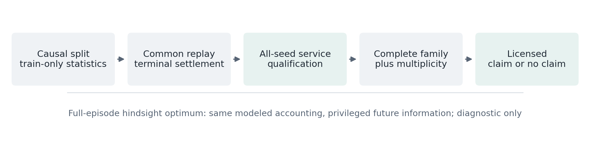
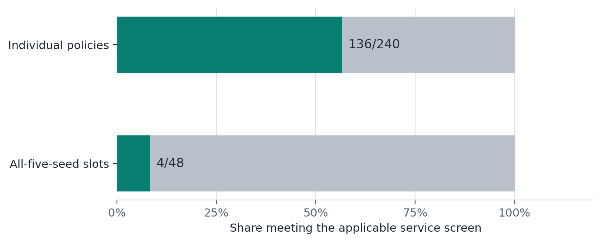
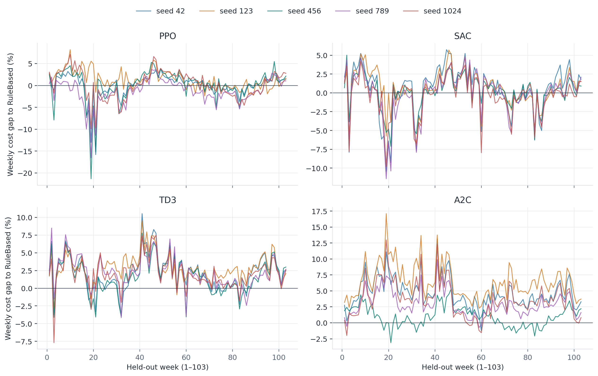
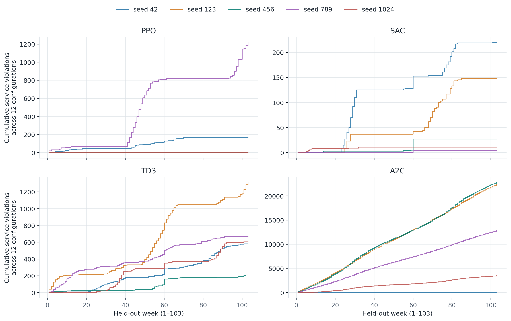
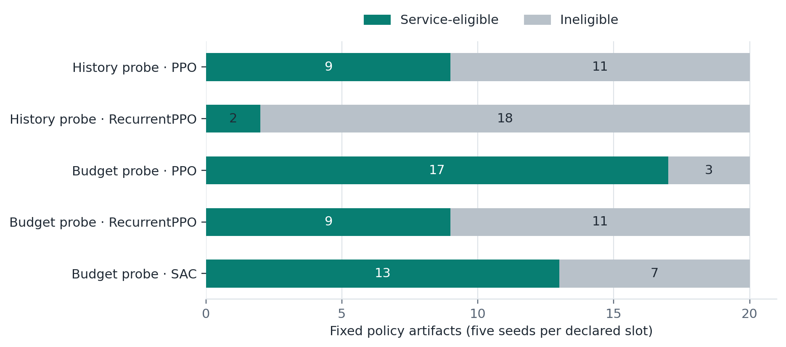
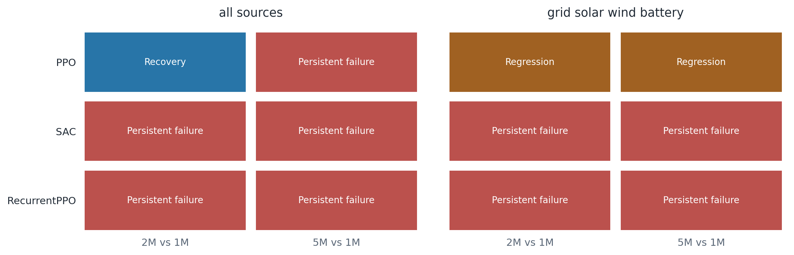
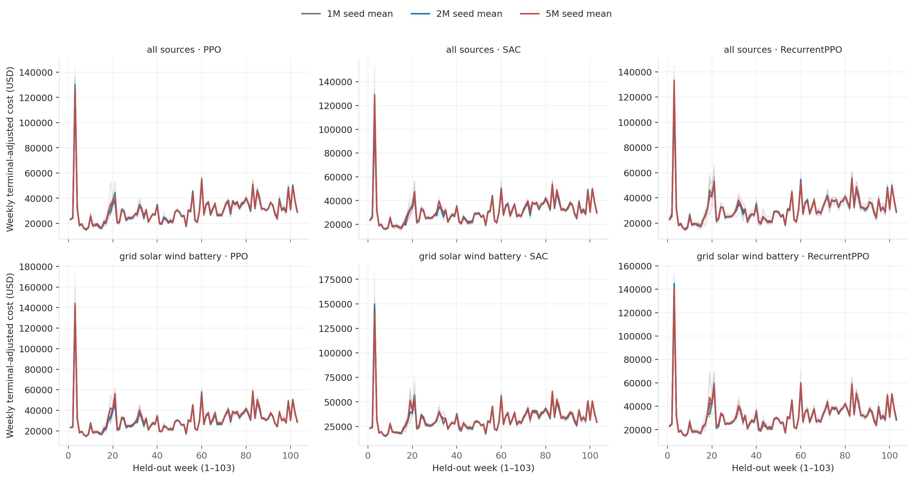
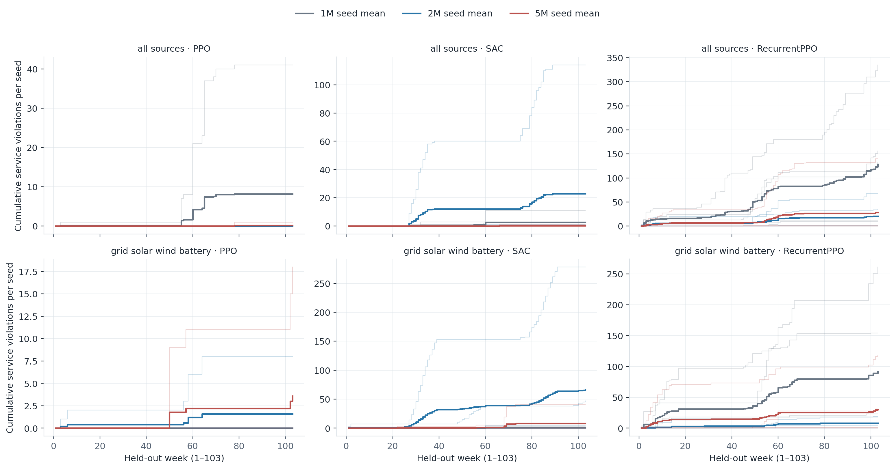

# Which Data-Centre Energy-Control Claims Survive Strict Qualification?

*A causal, seed-aware benchmark against an environment-consistent hindsight reference*

**Babasola Osibo**

**Preprint — version 0.2.1, 26 September 2026**

**Keywords:** data-centre energy management; reinforcement learning; service qualification; reproducibility; terminal accounting; causal evaluation; battery dispatch

## Abstract

Reinforcement-learning studies for data-centre energy control often emphasize average reward or cost, even when feasibility, training-seed variability, terminal accounting, and the information advantage of an offline reference can materially alter the conclusion. We present the **Data-Centre Energy-Control Claim Qualification Benchmark**, a qualification-first corrected reanalysis in which four reinforcement-learning algorithms—PPO, SAC, TD3, and A2C—are trained across 12 energy-source configurations with five predeclared seeds, then evaluated on the same 103 non-overlapping 2024–2025 weeks that were excluded from training. This is not a pristine first look or prospective confirmation. Training uses only 2020–2023 data and frozen training-side normalization. All online controllers and environment-consistent hindsight references share terminal-adjusted accounting, and a controller family becomes headline-eligible only when every required trained seed satisfies the frozen service criterion.

The primary campaign contains 240 learned policies and 48 baseline records. Only 136 of 240 learned policies are individually service-eligible, and only 4 of 48 algorithm–configuration slots satisfy the strict all-seed headline rule. Consequently, the 48-slot primary family versus RuleBased is incomplete and the frozen analysis correctly makes no primary Holm-corrected superiority claim; the three corresponding baseline-comparison families are incomplete as well. A separate exhaustive accounting check replayed all 209 supplemental records over 103 episodes and 168 hours—3,616,536 record-hours—with maximum absolute residual equal to zero in all 27 audited channels. The independent auditor verified the recorded, content-addressed replay evidence and its derivable identities but explicitly did not re-simulate the environments. Secondary foresight and Pareto comparisons are reported with their frozen multiplicity procedures, but their inclusion of service-violating policies limits the claims they license.

A post-primary extension replaces persistence price summaries with causal weekly seasonal-naive summaries inside one fixed threshold dispatch policy. Across all 12 configurations and 103 weeks, both arms remain service-compliant. Per configuration, the replacement reduces terminal-adjusted cost by USD 37,691–106,254 and captures 5.075%–9.162% of the corresponding persistence-to-hindsight opportunity. The opportunity-weighted summary is 7.414%. This is a forecast-input ablation, not model-predictive control. The USD 707,694.44 sum across twelve mutually exclusive benchmark panels is an arithmetic summary, not one facility's realizable saving.

Two separately frozen, post-primary probes evaluated history conditioning and training budget across 100 accepted policies on the same 103 weeks. Exactly 50 policies were service-eligible. RecurrentPPO failed the all-five-seed service screen in each of four tested configurations. All six declared extension cost families were incomplete, so none supports family-level Holm-adjusted cost inference. Across 12 primary budget transitions, the frozen labels were one compliance recovery, nine persistent failures, and two regressions. These are exploratory recipe- and budget-specific results, not proof of a memory mechanism or convergence.

The principal finding is methodological rather than a universal algorithm ranking: attractive descriptive averages need not survive strict constraint qualification and complete accounting. The benchmark asks which controller claims remain defensible after causal information boundaries, seed variability, terminal settlement, and an identical-environment hindsight comparison are made explicit. The reserved 2026 prospective confirmation has not been performed.

## 1. Introduction

Data centres increasingly combine grid electricity, local renewable generation, dispatchable generation, storage, cooling, and deferrable workload. These resources make energy management a sequential decision problem, and reinforcement learning (RL), rule-based control, and model-predictive control (MPC) have all been proposed as solutions. The scientific difficulty is no longer merely demonstrating that a sophisticated controller can reduce a mean cost in one simulation. The harder problem is deciding whether that apparent advantage survives realistic information restrictions, service constraints, independently trained seeds, consistent terminal accounting, and comparison with a reference governed by the same physical equations.

This distinction matters because a low mean from an unreliable controller is not interchangeable with a reproducibly feasible control family. Averaging successful and failed seeds can conceal the operational boundary. Likewise, an offline optimizer can be a useful diagnostic ceiling while remaining non-deployable; confusing those roles turns privileged hindsight into an unfair online comparison. Small accounting inconsistencies at an episode boundary can also reverse close comparisons.

We therefore organize the experiment around **conclusion survival**. A conclusion survives only if its required population is complete, the controllers satisfy the predeclared service criterion, the uncertainty procedure supports the comparison, and every controller and reference uses the same environment and terminal-settlement definitions. This creates a deliberately demanding test. It can produce a null primary conclusion even when descriptive rankings look favorable, but that null is informative: it identifies the point at which the stronger scientific claim ceases to be licensed.

### 1.1 Why the study proceeded in stages

An [earlier public research release](https://doi.org/10.5281/zenodo.21711315) presented a benchmark and provisional controller comparisons, while explicitly identifying train-only normalization and agreement between its offline optimizer and live simulation as unresolved validation issues. The present study began by rebuilding that comparison with training-only preprocessing, observable endogenous state, one common environment/terminal-accounting contract, and an optimizer checked against the same equations. The earlier release establishes provenance; its interim numerical conclusions are not treated as results of this corrected reanalysis.

The corrected primary comparison then exposed a different issue: only four of 48 algorithm–configuration recipes passed the all-five-seed service screen. That prevented a complete primary cost-inference family. We therefore asked whether three specific, plausible limitations could explain the qualification gap or change its interpretation. First, a fixed threshold policy received better *causal price summaries* while its dispatch rules stayed fixed, isolating one forecast-input change without pretending to implement MPC. Second, a recurrent PPO recipe was compared with a feedforward companion on storage-rich configurations, testing a history-conditioned **recipe** while acknowledging their unequal network capacities. Third, exact full-state continuations from the one-million-interaction checkpoints toward requested 2M and 5M targets tested whether the result was sensitive to training budget, without claiming exact step counts or convergence. The exhaustive supplemental replay was an accounting check on additional foresight, objective-weight, and storage-size results, not a fourth controller invention.

These follow-ups were chosen because information, history, and training budget are distinct objections to a qualification-first finding. All were designed **after** the primary analysis and are exploratory. The history and budget protocols were frozen before their own held-out evaluation; the price-input probe has weaker historical custody and remains under independent publication review. Favorable outcomes in any probe could not retroactively make the primary family complete. A separately reserved 2026 period is intended for prospective confirmation once the full interval is available.

The study addresses five questions:

1. Which controller recipes remain eligible when every required trained seed must satisfy the frozen service rule?
2. How large is the residual gap between eligible online control and a verified environment-consistent hindsight reference?
3. Do frozen secondary foresight, objective-weight, and storage-size analyses preserve their narrower conclusions under complete accounting?
4. How much can causal weekly price information change one fixed online threshold policy without changing its physical rules or thresholds?
5. In separately frozen exploratory extensions, did a history-conditioned PPO recipe or larger interaction budgets change the qualification-first conclusion?

Our contribution is not a claim to be the first data-centre RL, recurrent, storage, forecast-aware, or multi-source controller. Closely related systems already occupy those categories. Instead, the contribution is a reproducible evaluation discipline that makes it difficult to promote a controller on an attractive subset of results. Figure 1 shows the claim gate used throughout the corrected analysis.

*Figure 1. Causal preprocessing, common replay and terminal settlement, all-seed service eligibility, and complete-family multiplicity must be satisfied before a primary cost claim. The full-episode hindsight optimum uses the same modeled accounting but privileged future information and is diagnostic only.*

## 2. Related work

### 2.1 Data-centre control, storage, and forecasts

Learned and optimization-based control for data centres is well established, and the broader RL evidence has been synthesized in a recent systematic review ([Kahil et al., 2025](https://doi.org/10.1016/j.apenergy.2025.125734)). Lazic et al. developed genuine learned-model, constrained receding-horizon control for data-centre cooling ([Lazic et al., 2018](https://proceedings.neurips.cc/paper_files/paper/2018/hash/059fdcd96baeb75112f09fa1dcc740cc-Abstract.html)). Model-free RL has also been evaluated for data-centre energy saving ([Mahbod et al., 2022](https://doi.org/10.1016/j.apenergy.2022.119392)). DeepPM combined history-sensitive RL with UPS battery and thermal flexibility ([Shao, Islam, and Ren, 2020](https://www.cs.ucr.edu/~zshao006/files/p1_power_mangement.pdf)), while hierarchical MPC has been studied for hybrid energy-storage dispatch in internet data centres ([Wang et al., 2023](https://doi.org/10.1016/j.apenergy.2022.120414)). Recurrent and latent-state policies have been examined for partially observable building and data-centre HVAC control ([Biemann et al., 2021](https://orbit.dtu.dk/en/publications/addressing-partial-observability-in-reinforcement-learning-for-en/)) and for response to real-time prices ([Biemann et al., 2023](https://orbit.dtu.dk/en/publications/data-centre-hvac-control-harnessing-flexibility-potential-via-rea/)).

Recent benchmark and integrated-control work broadens the scope further. DC-CFR combines workload shifting, cooling, and battery control across regions ([Sarkar et al., 2024b](https://arxiv.org/abs/2403.14092)); DCRL-Green offers a configurable digital-twin benchmark ([Sarkar et al., 2024a](https://ojs.aaai.org/index.php/AAAI/article/view/30580)); and SustainDC includes workload, cooling, battery, forecasts, and cost/carbon/water objectives ([Naug et al., 2024](https://arxiv.org/abs/2408.07841)). Integrated rolling optimization with workloads, renewables, batteries, and forecasts has also been published ([Yang et al., 2025](https://www.sciencedirect.com/science/article/pii/S0360544225028749)), while decision-focused forecast-to-control learning continues to develop ([Yang et al., 2026](https://www.nature.com/articles/s41598-026-67967-z)). These studies preclude a broad novelty claim based only on combining RL, recurrence, forecasts, renewable sources, and storage.

### 2.2 Evaluation reliability in reinforcement learning

RL comparisons are sensitive to implementation choices, hyperparameters, random seeds, and reporting practices ([Henderson et al., 2018](https://ojs.aaai.org/index.php/AAAI/article/view/11694)). Seed count controls statistical uncertainty rather than serving as a ritual fixed number ([Colas et al., 2018](https://arxiv.org/abs/1806.08295)), and few-run evaluation benefits from interval estimates, robust aggregates, and performance profiles ([Agarwal et al., 2021](https://proceedings.neurips.cc/paper/2021/hash/f514cec81cb148559cf475e7426eed5e-Abstract.html)).

Our benchmark complements this literature by making feasibility a prerequisite for the primary algorithmic claim. Five seeds are treated as five trained artifacts under an empirical reproducibility screen, not as proof of a real-world failure probability. The held-out weeks are repeated paired evaluations nested within those seeds; they are not counted as hundreds of independent training replicates.

### 2.3 Positioning of the present study

The closest literature already establishes controller ingredients. The remaining question is whether an apparent advantage survives a stricter evaluation contract. The present benchmark contributes: (i) a causal temporal split with frozen training-derived preprocessing; (ii) identical held-out episodes across controllers; (iii) a verified same-environment hindsight reference; (iv) common terminal settlement; (v) all-seed service eligibility before primary promotion; and (vi) a fixed conclusion-survival mechanism that refuses unsupported claims.

## 3. Methods

### 3.1 Temporal boundary and operational substrate

Training and preprocessing statistics use the interval from 2020-01-01 through the end of 2023. Evaluation uses a frozen 2024–2025 corrected-reanalysis population of 103 non-overlapping 168-hour episodes. These weeks were excluded from training but have already participated in the corrected analysis and are not a pristine first-look confirmation set. The same episode manifest and order are used across controllers. Normalization during evaluation reuses the frozen training-side statistics rather than refitting on evaluation data.

The campaign evaluates 12 named source configurations spanning grid-only operation and combinations of solar, wind, dispatchable gas generation, and battery storage. The modeled battery in the main campaign has the frozen capacity and power settings defined by the benchmark; this study does not infer a generally optimal battery design. Observable endogenous state includes battery state of charge, deferred-work backlog, a latched service flag, and time to episode end, alongside current exogenous conditions and forecast summaries.

The objective combines the benchmark's frozen cost, carbon, water, service, and terminal-settlement definitions. All compared controllers are evaluated through the same environment accounting. Terminal backlog and terminal state-of-charge adjustments prevent a controller from appearing favorable by exporting unfinished work or depleted storage beyond the episode boundary.

### 3.2 Primary controller population

The primary learned population comprises PPO, SAC, TD3, and A2C trained across 12 configurations and five seeds (42, 123, 456, 789, and 1024), for 240 policies. Four baselines are evaluated in every configuration, producing 48 baseline records. Each record is paired to the same 103 held-out weeks.

The campaign logs sometimes call parallel execution processes “workers.” The scientific unit shown in the weekly figures is the independently trained seed policy, not the machine process that happened to execute it. Each algorithm therefore has five seed-worker trajectories. Infrastructure sharding changed placement only and did not change the frozen job definition.

The environment-consistent hindsight references are optimization-derived diagnostic bounds. `env_opt_unconstrained` and `env_opt_compliant` use the live environment equations and the same terminal channels as controller replay. They have access to the complete episode and are therefore **not online or deployable controllers**. Their purpose is to establish a same-environment ceiling and quantify the residual opportunity, not to claim a realizable operating policy.

### 3.3 Qualification-first primary analysis

Individual policy eligibility is derived from exact environment replay of the service criterion. A primary algorithm–configuration slot is headline-eligible only when all five required seeds are eligible. This is intentionally stricter than removing failed seeds or averaging violations into a favorable cost.

The frozen primary family contains 48 algorithm-versus-RuleBased tests. A complete family is required before Holm correction. If any slots are ineligible, descriptive values may still be reported, but the incomplete family cannot yield a Holm-corrected primary superiority claim. Missing or failed policies are not silently replaced.

For eligible comparisons, the frozen procedure uses 10,000 crossed training-seed × paired-week bootstrap resamples with RNG seed 20260803, two-sided equal-tailed 95% percentile intervals, and the predeclared centered two-sided resampling p-value. Weekly observations remain paired across controllers. Seed is the independent training unit; the 103 weeks do not create 103 additional trained policies.

### 3.4 Supplemental verification and robustness families

The supplemental population contains 120 foresight policies, 80 Pareto policies, five 40-MWh policies, and four 40-MWh baselines, for 209 records. The exhaustive accounting check replayed every supplemental record over all 103 weeks and 168 hours without sampling. It compared 13 hourly and 14 terminal channels against the frozen per-channel tolerance table and failed closed on missing, duplicate, non-finite, mismatched, or incomplete evidence.

Foresight and Pareto comparisons retain their separately frozen multiplicity families. Their protocol differs from the primary family because non-compliant supplemental policies remain in those analyses. We therefore report them as secondary analyses with an explicit service caveat rather than treating them as evidence of deployment-ready superiority. The available sizing comparison covers 20 and 40 MWh only; a 10-MWh arm was not materialized. In the 40-MWh PPO arm, two of five seeds are implicated across four episodes and nine service violations; every sizing claim must carry that service caveat.

### 3.5 Causal price-forecast-input ablation

The price-information probe replayed the same deterministic threshold policy across all 12 configurations and 103 held-out weeks. One arm received persistence summaries; the other replaced two price-summary entries with causal weekly seasonal-naive summaries derived from the corresponding prior-week observations, falling back to persistence before a complete lag was available. Thresholds, environment physics, episode identities, objective, storage design, and terminal accounting remained fixed.

The controller's legacy class name is `MPCPolicy`, but it contains no dynamics model, horizon optimizer, optimized action sequence, or receding-horizon replanning. We therefore label the arms `ThresholdPolicy-Persistence` and `ThresholdPolicy-SeasonalNaivePrice`. The offline comparator remains `env_opt_compliant` and is identified as a hindsight reference.

The aggregate normalized forecast-input effect is

\[
\frac{\sum_e C_{\mathrm{persistence},e}-\sum_e C_{\mathrm{seasonal},e}}
{\sum_e C_{\mathrm{persistence},e}-\sum_e C_{\mathrm{hindsight},e}}.
\]

This quantity describes movement within the persistence-to-hindsight opportunity. It is not intrinsically bounded to the unit interval and is not an estimate of the general value of forecasts.

### 3.6 Frozen history-conditioning and training-budget probes

The history-conditioning probe evaluated a RecurrentPPO recipe on four storage-rich configurations using five seeds and one million requested environment interactions. Because the historical feedforward PPO differed in rollout and minibatch geometry, the extension added a matched feedforward PPO companion: four configurations × five seeds = 20 additional jobs with the same `n_steps=512`, `batch_size=128`, learning rate, epochs, discount, GAE, clipping, activation, vectorization, evaluation contract, and interaction target, but no recurrent state. Under the frozen 21-observation/4-action architecture, the declared networks analytically imply approximately 11,465 trainable parameters for matched PPO and 332,873 for RecurrentPPO, a 29.03× capacity difference. This tests recurrence under a matched recipe, not a capacity-matched experiment or memory alone.

The training-budget probe continued PPO, SAC, and the predeclared recurrent recipe on `all_sources` and `grid_solar_wind_battery`. Thirty algorithm–configuration–seed trajectories resumed exact full-state 1M checkpoints and continued once to 5M, preserving fixed 2M and 5M snapshots: 60 evaluated artifacts. It is a budget-sensitivity analysis, not a convergence proof. The frozen rules forbade restart, checkpoint, budget, or architecture selection from outcomes.

Before these policies touched 2024–2025 evaluation data, the protocol froze the exact policy population, artifact schema, episode order, recurrent-state reset semantics, deterministic-action rule, terminal verification, failed-policy treatment, comparison families, uncertainty procedures, materiality thresholds, and conclusion-survival language. The primary history-conditioning family contains four matched-recipe cost comparisons. The primary budget family contains 12 fixed 2M/5M-versus-1M comparisons; a separate secondary family contains all 18 combinations of 1M/2M/5M, PPO/SAC/RecurrentPPO and the two budget-probe configurations versus RuleBased. In total, six declared cost families have sizes 4/4/4/12/6/18. Each family has its own Holm procedure only if complete. A slot requires all five service-eligible seeds; incomplete families receive no partial Holm claim, and compliance recovery or persistent failure is reported before cost. The cost smallest effect size of interest is 1%, and the compliant-optimum gap closes only when its 95% upper bound is at most one percentage point. These are author-chosen round, pre-outcome screens, not empirically or citation-calibrated industry standards. The complete descriptive sensitivity analysis reports 0.5×, 1× and 2× thresholds without selecting among them after outcomes. Policies were evaluated through the pinned public deterministic prediction API; the evaluator added no clipping, retry, fallback, alternate action or substitution.

The 100 policies were evaluated together once, on the same 103 weeks, with one top-level invocation and no retries. The sealed result and custody evidence were independently audited. This completed exploratory evaluation did not alter the historical primary campaign or make the 2024–2025 weeks a prospective confirmation set.

## 4. Results

### 4.1 Evidence completeness and reference verification

The main artifact contains exactly 288 records: 240 learned policies and 48 baselines. All record inventories, episode identities, array hashes, shapes, and dtypes were independently reconciled. Across the verified foundation, 29,664 unconstrained ceiling comparisons, 18,952 compliant-ceiling comparisons, 1,236 bound-ordering comparisons, 3,708 optimizer-gap checks, and 2,472 optimizer-to-environment replay flags produced zero failures. All 1,236 Candidate B guard certificates passed under the frozen numerical envelope.

The supplemental replay contains exactly 209 records and 3,616,536 record-hours. All 27 audited residual channels have maximum absolute residual equal to zero. The size-40 compliant optimum is service-compliant across all 103 episodes, and optimizer/environment service counts agree.

These checks validate the benchmark's accounting and custody. They do not make the hindsight references deployable and do not establish that the modeled substrate reproduces every physical feature of a production data centre.

### 4.2 Primary qualification result

Of 240 learned policies, 136 are individually eligible under the frozen environment service criterion. All 48 baselines are eligible. At the stricter algorithm–configuration level, only four of 48 slots satisfy the all-five-seed requirement:

- SAC on `grid_solar_battery`;
- PPO on `grid_solar_wind_battery`;
- SAC on `grid_wind_battery`; and
- SAC on `grid_wind_gas`.

Thus, each of the four 48-slot controller-versus-baseline families contains only four testable slots and 44 compliance-only exclusions. The primary family versus RuleBased has status `INCOMPLETE_ELIGIBILITY_NO_HOLM_CLAIM`; no primary Holm value is emitted. Rankings across the 96 algorithm–configuration rows remain descriptive and are not used for algorithm selection.

This is the central result. The available evidence does not license a multiplicity-corrected claim that any learned algorithm generally beats RuleBased across the declared 48-test primary family. Nor does it license the opposite universal claim that RL cannot help. It shows that most learned algorithm–configuration recipes fail the benchmark's stronger reproducibility-and-service prerequisite.

*Figure 2. Primary-campaign service qualification at two different units: individual trained policies (136/240) and algorithm–configuration slots with all five required seeds eligible (4/48). These percentages have different denominators and are not independent estimates of a deployment failure probability. The incomplete 48-slot family produces no primary Holm-corrected cost claim.*

Figure 3 exposes the weekly cost trajectories behind the aggregate result. For each algorithm and seed, the plotted value is the percentage difference between the sum of that seed's terminal-adjusted weekly costs across all 12 configurations and the corresponding sum for RuleBased. Every algorithm, seed, configuration, and week is included. Negative values favor the learned policy on cost. Because the traces include service-ineligible policies, they are descriptive and cannot replace the qualification gate.

*Figure 3. Weekly terminal-adjusted cost difference from RuleBased for all four primary algorithms and all five independently trained seed workers over the 103 held-out weeks. Each line aggregates the complete 12-configuration panel for one seed by a ratio of weekly cost sums. No seed or week is selected by outcome. These cost traces deliberately include ineligible policies and therefore do not license a service-qualified superiority claim.*

The corresponding service trajectories in Figure 4 explain why the cost lines alone are insufficient. Violations accumulate very differently across seeds of the same algorithm. Some seed lines remain at zero, while others accrue failures in distinct portions of the two-year evaluation. The magnitude is a count across the 12 configurations, not an estimated deployment failure rate.

*Figure 4. Cumulative recorded service violations across all 12 configurations for each primary algorithm and seed worker, week by week. The five lines in each panel are the complete predeclared seed set. The figure visualizes the seed instability that produces only 4/48 all-five-seed-eligible slots; it is not a probability model for field reliability.*

### 4.3 Secondary robustness results and their boundary

The foresight family is complete and applies Holm correction to 24 comparisons; five of 24 are rejected under the frozen procedure. However, 57 of 120 foresight-policy records have nonzero service violations and remain included by design. The Pareto family is also complete and reports rejection in all three comparisons, while 23 of 80 Pareto records have nonzero service violations. These findings describe the frozen secondary populations; they do not establish service-qualified controller superiority.

The corrected 24.276651706817397% RuleBased summary is the equal-weight arithmetic mean of four per-configuration percentages—22.28600844156709%, 23.48006227537967%, 24.083365366610128% and 27.257170743712706%—where each percentage uses RuleBased controller cost as its denominator. It is not the pooled controller-denominator ratio of 24.042405702302204%, and it is not directly comparable with the later compliant-optimum-gap metric, whose denominator is hindsight cost. The sizing output reports 20-MWh and 40-MWh results only. The 40-MWh PPO population includes two of five seeds implicated across four episodes and nine service violations. Because a 10-MWh baseline and optimum are absent, no 10/20/40-MWh monotonicity or sizing-survival claim is made.

### 4.4 Causal forecast-input ablation

The completed price-input-ablation result and serialized self-audit were replayed in full by the implementing agent. All 2,472 controller/configuration episodes and 415,296 environment steps matched the stored costs, service vectors, and action hashes; all service counts were zero. This replay audit is non-independent and remains subject to final combined publication review.

Across the complete evaluated population:

| Quantity | Aggregate terminal-adjusted cost (USD) |
|---|---:|
| `ThresholdPolicy-Persistence` | 51,659,140.61 |
| `ThresholdPolicy-SeasonalNaivePrice` | 50,951,446.17 |
| `env_opt_compliant` hindsight reference | 42,113,795.28 |
| Seasonal-naive arithmetic panel-sum reduction from persistence | 707,694.44 |
| Persistence-to-hindsight opportunity | 9,545,345.33 |
| Normalized forecast-input effect | 7.414% |

Both online threshold-policy arms report zero service violations in every evaluated episode. The normalized effect is positive in all 12 configurations, ranging from approximately 5.075% to 9.162%. Every configuration has 33 improved weeks. The eight non-battery configurations have 33 changed and zero worse weeks; the four battery-bearing configurations have 36 changed weeks, comprising 33 improved and three worse. The historical future-invariance gate sampled exactly five hours; later source inspection and differential probes support the complete causal construction, but the original gate was not exhaustive.

The result supports the narrow statement that causal weekly price summaries improved this fixed threshold policy on this held-out population. The twelve configurations are mutually exclusive alternatives, so the panel-sum dollar reduction is not one facility's realizable saving. The result does not show that forecasts generally solve dispatch, that the resulting controller is MPC, or that the heuristic approaches the hindsight optimum.

### 4.5 Statistical reproducibility

The independent primary-analysis audit reproduced every declared method, table, figure label, ranking, multiplicity decision, and conclusion value from the frozen artifacts. Twenty-nine lower confidence-interval endpoints differed by only one to five units in the last place under a different NumPy quantile implementation. Exact rational interpolation placed the discrepancies at approximately machine precision and did not change any interval conclusion, p-value, Holm decision, ranking, or claim boundary.

### 4.6 Exploratory history-conditioned and budget extensions

The combined history-conditioning and budget evaluation completed all 100 accepted policies on all 103 frozen weeks, yielding 1,730,400 policy–environment steps and exactly 50 service-eligible policies. The independent result-and-conclusion audit passed with zero blockers and zero required fixes. It checked the sealed outcome and a corrected implementation-handoff hash, but did not confer prospective-confirmation or publication status. Figure 5 reports every probe/algorithm population, including all ineligible policies.

*Figure 5. Fixed history-conditioning and budget-probe policy populations by algorithm. Each row contains 20 policy artifacts. Eligibility requires zero environment service violations across all 103 weeks; the bar segments sum to all 100 evaluated policies. This is a service screen, not a cost comparison.*

| Frozen cost family | Declared members | Complete after service screen? | Holm-adjusted cost claim? |
|---|---:|---|---|
| History probe: primary recurrence versus matched PPO | 4 | No | No |
| History probe: secondary recurrence versus RuleBased | 4 | No | No |
| History probe: contextual recurrence versus historical PPO | 4 | No | No |
| Budget probe: primary 2M/5M versus 1M | 12 | No | No |
| Budget probe: secondary 5M versus 2M | 6 | No | No |
| Budget probe: secondary budgets versus RuleBased | 18 | No | No |

The recurrent recipe failed the 5/5 seed service screen in **all four** tested configurations; across its 20 policies, only two were individually eligible. The matched feedforward PPO population had nine of 20 individually eligible policies, but no tested configuration produced a complete all-seed-eligible matched pair. This does not identify recurrence itself as the cause, because the architectures differ substantially in parameter count and other unmeasured mechanisms may matter.

The budget probe yielded one compliance recovery, nine persistent compliance failures, and two compliance regressions across its 12 predeclared primary 2M/5M-versus-1M transitions. Specifically, `all_sources/PPO` recovered 5/5 eligibility at 2M from an ineligible 1M reference, but failed again at 5M; its 2M compliant-optimum gap remained open. `grid_solar_wind_battery/PPO` regressed from an eligible 1M reference at both 2M and 5M. The remaining nine transitions retained service ineligibility. The six secondary 5M-versus-2M transitions contain one regression and five persistent failures. Figure 6 shows the complete primary transition population rather than a selected budget or configuration.

*Figure 6. Frozen service-first classifications for every primary 2M/5M-versus-1M budget slot. Recovery, persistent failure, and regression refer to all-five-seed qualification relative to the 1M reference, not to a valid family-level cost inference. More interactions did not produce a monotone service-eligibility pattern in these two configurations.*

Figure 7 shows the complete weekly cost population behind those classifications. Each panel contains all five seed workers at each of the 1M, 2M, and 5M snapshots; faint lines are individual seeds and the heavier line is their arithmetic mean. The similarity of many cost trajectories does not imply equivalence because the service screen is evaluated separately and the declared inference families are incomplete.

*Figure 7. Weekly terminal-adjusted cost for every training-budget-probe algorithm, configuration, budget snapshot, seed, and held-out week. Columns are PPO, SAC, and RecurrentPPO; rows are the two frozen storage-rich configurations. Colors identify the 1M, 2M, and 5M snapshots. Faint curves are the five individual seed workers and heavy curves are seed means. No favorable checkpoint, seed, or time window is selected.*

Figure 8 plots the service record for the same 90 traces. Longer training does not move every seed in the same direction: some lines stay flat, some accumulate fewer violations, and others regress. These complete trajectories are the basis for the frozen labels of one recovery, nine persistent failures, and two regressions.

*Figure 8. Cumulative service violations by held-out week for the complete 1M/2M/5M budget population. Faint curves are individual seed workers; heavy curves are the per-week mean across the five seeds. The panels share the population and ordering of Figure 7. The traces show why interaction count is a sensitivity variable here, not evidence of monotone convergence.*

All six declared cost families are incomplete; unadjusted descriptive estimates and raw p-values in the sealed analysis are not partial-family significance claims. The evaluated extensions are post-primary exploratory probes. Their outcomes cannot establish that extra budget causes deterioration, that recurrence alone is ineffective, or that any algorithm is universally inferior. The full frozen sensitivity grid changes no eligibility gate or inference status.

## 5. Discussion

### 5.1 Qualification changes the scientific conclusion

A conventional results narrative could rank mean costs and highlight the best-performing configurations. That would answer a different and weaker question. Under the predeclared qualification-first rule, 44 of 48 primary slots cannot enter the complete primary family, so there is no primary Holm-corrected superiority claim. The absence of that claim is not an analysis failure; it is evidence that seed-level feasibility is a dominant part of the controller comparison.

The benchmark therefore separates three propositions that are often conflated: a policy can achieve a favorable mean on completed episodes; one trained seed can be feasible; and an algorithm–configuration recipe can remain feasible across all required seeds. Only the third supports the headline comparison here.

### 5.2 The online-to-hindsight gap is diagnostic, not a deployment target

The environment-consistent hindsight reference shares the controller's physical and accounting substrate, which makes its gap informative. It also sees the full episode, which makes it non-causal and non-deployable. A surviving gap can be consistent with information limits, approximation error, optimization difficulty, representation limits, temporal credit assignment, or several of these mechanisms. Outcome data alone cannot uniquely identify the cause.

The price-input result offers one partial diagnostic. Better causal price information improves the fixed threshold policy, but accounts for only 7.414% of the opportunity-weighted persistence-to-hindsight benchmark summary. This suggests that this particular forecast interface and policy structure leave most of the measured opportunity unresolved. It does not establish whether richer causal forecasts, a true receding-horizon optimizer, or a different learning architecture would close the remainder.

### 5.3 Why mixed or negative extension results remain useful

The history and budget probes tested two plausible objections to the primary result without rescuing a preferred algorithm: perhaps the policies needed recurrent history, or perhaps they needed more interactions. The frozen evaluation instead found recurrent all-seed service failure in every history-probe configuration and a mixed budget-probe compliance-transition pattern. One recovery at 2M did not repair the incomplete budget family, and two regressions prevented a monotone training-budget narrative. Incomplete families also cannot establish practical equivalence: absence of a permitted superiority claim is not evidence that algorithms perform the same. The result is narrower than “recurrence fails” or “more training hurts”; it says these specific post-primary recipes did not make the predeclared cost families eligible. The one-shot design forbids choosing a favorable checkpoint, budget, threshold, or conclusion after seeing outcomes.

### 5.4 Implications for benchmark reporting

The results support reporting both performance and qualification. At minimum, future benchmark tables should distinguish individual-policy eligibility, all-seed family eligibility, descriptive means, uncertainty conditional on an eligible population, and distance to a same-environment hindsight reference. A single scalar reward obscures these distinctions.

## 6. Limitations

1. **Simulation rather than deployment.** The study uses a modeled single-facility substrate with real/replayed signals. It is not a field trial, shadow deployment, or hardware validation.
2. **Geographic scope.** The operational setting is ERCOT-centred. Results do not establish multi-region generality; prior sizing literature indicates that location can materially change renewable and storage designs ([Figini and Paolone, 2025](https://www.sciencedirect.com/science/article/pii/S2352467725003029)).
3. **Finite algorithm and seed population.** Conclusions apply to four frozen algorithms and five trained seeds. The all-seed rule is an empirical reproducibility screen, not a population-level reliability probability.
4. **Incomplete primary family.** Only 4 of 48 primary slots are headline-eligible. No primary Holm-corrected superiority claim is available.
5. **Secondary service asymmetry.** The frozen foresight and Pareto analyses include service-violating policies. Their corrected multiplicity results cannot be promoted as service-qualified deployment claims.
6. **Incomplete and service-asymmetric sizing evidence.** Only 20-MWh and 40-MWh rows exist; no 10/20/40-MWh survival or optimal-sizing claim is permitted. The 40-MWh PPO arm includes two of five seeds implicated across four episodes and nine service violations. Capacity, power, efficiency, and degradation have not been jointly swept.
7. **Hindsight reference.** `env_opt_compliant` is diagnostic and privileged by complete episode knowledge. It is not an online controller.
8. **Price-input identity and custody.** The forecast extension is a fixed-threshold input ablation, not MPC, and has no corrected inferential test. Its historical future-mutation gate sampled five hours, and its prior-art positioning postdated execution. The package lacks an exact runtime lock, original command/console transcript, execution timestamps and an external invocation witness/count. Its complete numerical replay audit is non-independent and remains subject to final external review.
9. **History-probe attribution.** Even with the matched feedforward companion, finite seeds and the analytically implied 11,465-versus-332,873 parameter counts (about 29.03×) prevent attribution to memory alone.
10. **Budget-probe scope.** Two larger interaction targets do not prove convergence or compute-equivalent training across algorithms.
11. **Post-primary extensions.** The price-input, history-conditioning, and budget probes were designed after the primary analysis. The history and budget probes were frozen before their own evaluation but are not pristine preregistered components of the primary campaign. The price-input probe has separate historical custody and prior-art limitations.
12. **Confirmation pending.** The reserved 2026 prospective period has not been evaluated. This preprint states that status plainly; a later confirmatory paper remains subject to that separate evaluation.
13. **Audit common-mode boundary.** The primary/supplemental and history/budget independent result audits reimplemented statistical calculations and reconciled content-addressed evidence; they did not rerun every environment simulation or certify every modeling assumption. Agreement establishes faithful execution of the tested frozen procedures, not that every protocol-level choice is necessarily correct. A shared specification error could remain undetected.
14. **Publication-pipeline boundary.** The manuscript, compact publication dataset, renderer, and rendered figures are publication products rather than evaluation outputs. The renderer's input is digest-gated; the publication files are versioned by the public release.

## 7. Reproducibility and release status

The manuscript, figure sources, compact result dataset, renderer, and public validation tests are available in the [GitHub repository](https://github.com/dev1-osibo/neither-near-optimal-nor-learnable). Raw input data, trained policy files, and research-operation records are not redistributed.

The prior public [GitHub v0.1.0 release](https://github.com/dev1-osibo/neither-near-optimal-nor-learnable/releases/tag/v0.1.0) is archived as Osibo, B. (2026), *Preliminary Leakage-Free Data-Center Energy Dispatch Benchmark* (version 0.1.0) [computer software], [Zenodo DOI 10.5281/zenodo.21711315](https://doi.org/10.5281/zenodo.21711315). That July 2026 artifact contains an earlier codebase, draft manuscript, and interim result files. It is **not** the reproducibility package for this corrected reanalysis. Its LP, controller-label, sizing, and numerical claims must not be silently carried into this paper.

All eight figures are reproducible in a public clone from [the figure renderer](figures/render_figures.py) and the included [compact publication dataset](figures/publication_results.json). The tested environment is documented in the [figure reproduction guide](figures/README.md), with direct and transitive packages fixed in the [requirements lock](figures/requirements.txt). The renderer verifies the compact dataset's digest and asserts the complete 240-policy primary population, 48 learned algorithm–configuration slots, 100 extension policies, five seeds, 12 primary configurations, two budget configurations, three budget algorithms, three requested snapshots, and 103 weeks. It does not execute an environment, optimizer, policy, bootstrap, or inferential test. SVG and PNG versions are provided for every figure.

The separately reserved 2026 confirmation interval is `[2026-01-05T00:00:00Z, 2027-01-04T00:00:00Z)`. No result from that period appears here. This public release contains the preprint, reproducible figures, compact publication data, and validation code needed to inspect the reported result populations. True online MPC, multi-region generalization, full capacity/power/degradation studies, and deployment validation remain separate future studies rather than retroactive reinterpretations of the present campaign.

No protocol, numerical output, or frozen classification was changed in preparing this manuscript.

## 8. Declarations

### 8.1 Author contribution and AI assistance

Babasola Osibo directed the research question, experimental decisions, protocol approvals, interpretation boundaries, and manuscript release decisions. AI-assisted tools contributed to portions of code development, verification workflow, figure generation, and editorial drafting under human direction. The human author remains responsible for the scientific claims, source verification, and submitted text. AI systems are not authors.

### 8.2 Data and materials

The public release contains the manuscript, article figures, compact publication results, figure-generation code, and validation tests. It does not redistribute raw workload and energy datasets, trained policies, execution captures, or research-operation records. The compact result file retains cryptographic identifiers for the source populations. Any later archival release must preserve applicable third-party data terms rather than republishing restricted inputs.

### 8.3 Audit status

The corrected primary and supplemental conclusions and the sealed history/budget conclusions passed independent result audits against preserved evidence. Those audits reproduced the specified calculations and evidence identities; they did not rerun every simulation or certify every modeling assumption. The price-input ablation has a complete numerical self-replay but has not received the same independent combined publication review. No 2026 prospective-confirmation result is included.

## 9. Conclusion

This benchmark does not support the simple headline that RL wins across data-centre energy configurations. It supports a more durable conclusion: controller performance claims can contract sharply when causal information boundaries, terminal accounting, service qualification, seed variability, multiplicity, and a consistent hindsight reference are enforced together.

Only four of 48 primary algorithm–configuration slots meet the all-seed eligibility rule, preventing a complete primary Holm claim despite descriptive performance differences. At the same time, exhaustive optimizer/environment verification and supplemental replay establish a strong accounting foundation. The causal price-input ablation shows that a fixed threshold policy can use weekly seasonal-naive price summaries to recover a measurable but limited portion of the persistence-to-hindsight opportunity.

The completed recurrent-recipe and training-budget extensions reinforced the need to put service qualification ahead of cost inference: 50 of 100 policies were individually eligible, but all six cost families remained incomplete. Their mixed service transitions did not establish an architecture or budget winner. The paper's defensible headline is therefore about **which data-centre energy-control claims survive an evaluation designed to resist selective interpretation**, not a universal verdict on RL. Prospective 2026 confirmation is still pending.

## References

1. Agarwal, R., Schwarzer, M., Castro, P. S., Courville, A. C., and Bellemare, M. G. (2021). [Deep reinforcement learning at the edge of the statistical precipice](https://proceedings.neurips.cc/paper/2021/hash/f514cec81cb148559cf475e7426eed5e-Abstract.html). *Advances in Neural Information Processing Systems*, 34.
2. Biemann, M., Liu, X., Zeng, Y., and Huang, L. (2021). [Addressing partial observability in reinforcement learning for energy management](https://doi.org/10.1145/3486611.3488730). In *Proceedings of the 8th ACM International Conference on Systems for Energy-Efficient Buildings, Cities, and Transportation*, 324–328. https://doi.org/10.1145/3486611.3488730
3. Biemann, M., Gunkel, P. A., Scheller, F., Huang, L., and Liu, X. (2023). [Data centre HVAC control harnessing flexibility potential via real-time pricing cost optimisation using reinforcement learning](https://doi.org/10.1109/JIOT.2023.3263261). *IEEE Internet of Things Journal*, 10(15), 13876–13894. https://doi.org/10.1109/JIOT.2023.3263261
4. Colas, C., Sigaud, O., and Oudeyer, P.-Y. (2018). [How many random seeds? Statistical power analysis in deep reinforcement learning experiments](https://arxiv.org/abs/1806.08295). arXiv:1806.08295.
5. Figini, E., and Paolone, M. (2025). [Achieving dispatchability in data centers: Carbon and cost-aware sizing of energy storage and local photovoltaic generation](https://doi.org/10.1016/j.segan.2025.101920). *Sustainable Energy, Grids and Networks*, 101920. https://doi.org/10.1016/j.segan.2025.101920
6. Henderson, P., Islam, R., Bachman, P., Pineau, J., Precup, D., and Meger, D. (2018). [Deep reinforcement learning that matters](https://doi.org/10.1609/aaai.v32i1.11694). *Proceedings of the AAAI Conference on Artificial Intelligence*, 32(1). https://doi.org/10.1609/aaai.v32i1.11694
7. Kahil, H., Sharma, S., Välisuo, P., and Elmusrati, M. (2025). [Reinforcement learning for data center energy efficiency optimization: A systematic literature review and research roadmap](https://doi.org/10.1016/j.apenergy.2025.125734). *Applied Energy*, 389, 125734. https://doi.org/10.1016/j.apenergy.2025.125734
8. Lazic, N., Boutilier, C., Lu, T., Wong, E., Roy, B., Ryu, M. K., and Imwalle, G. (2018). [Data center cooling using model-predictive control](https://proceedings.neurips.cc/paper_files/paper/2018/hash/059fdcd96baeb75112f09fa1dcc740cc-Abstract.html). *Advances in Neural Information Processing Systems*, 31.
9. Mahbod, M. H. B., Chng, C. B., Lee, P. S., and Chui, C. K. (2022). [Energy saving evaluation of an energy efficient data center using a model-free reinforcement learning approach](https://doi.org/10.1016/j.apenergy.2022.119392). *Applied Energy*, 322, 119392. https://doi.org/10.1016/j.apenergy.2022.119392
10. Naug, A., Guillen, A., Luna, R., Gundecha, V., Rengarajan, D., Ghorbanpour, S., Mousavi, S., Ramesh Babu, A., Markovikj, D., Kashyap, L. D., and Sarkar, S. (2024). [SustainDC: Benchmarking for sustainable data center control](https://arxiv.org/abs/2408.07841). arXiv:2408.07841.
11. Sarkar, S., Naug, A., Guillen, A., Luna, R., Gundecha, V., Ramesh Babu, A., and Mousavi, S. (2024a). [Sustainability of data center digital twins with reinforcement learning](https://doi.org/10.1609/aaai.v38i21.30580). *Proceedings of the AAAI Conference on Artificial Intelligence*, 38(21), 23832–23834. https://doi.org/10.1609/aaai.v38i21.30580
12. Sarkar, S., Naug, A., Luna, R., Guillen, A., Gundecha, V., Ghorbanpour, S., Mousavi, S., Markovikj, D., and Ramesh Babu, A. (2024b). [Carbon footprint reduction for sustainable data centers in real-time](https://arxiv.org/abs/2403.14092). arXiv:2403.14092.
13. Shao, Z., Islam, M. A., and Ren, S. (2020). [DeepPM: Efficient power management in edge data centers using energy storage](https://doi.org/10.1109/CLOUD49709.2020.00058). In *2020 IEEE 13th International Conference on Cloud Computing*, 370–379. https://doi.org/10.1109/CLOUD49709.2020.00058
14. Wang, K., Ye, L., Yang, S., Deng, Z., Song, J., Li, Z., and Zhao, Y. (2023). [A hierarchical dispatch strategy of hybrid energy storage system in internet data center with model predictive control](https://doi.org/10.1016/j.apenergy.2022.120414). *Applied Energy*, 331, 120414. https://doi.org/10.1016/j.apenergy.2022.120414
15. Yang, L., Chen, X., Fang, X., and Yang, Q. (2025). [Optimal coordinated management of integrated electricity-heat-computation systems in geographically distributed data centers](https://doi.org/10.1016/j.energy.2025.137232). *Energy*, 332, 137232. https://doi.org/10.1016/j.energy.2025.137232
16. Yang, P., Chen, T., Zhong, Z., Wu, Y., and Luo, Q. (2026). [Decision focused online learning for real time energy aware scheduling of interconnected data centers with photovoltaic generation and battery storage](https://doi.org/10.1038/s41598-026-67967-z). *Scientific Reports*. https://doi.org/10.1038/s41598-026-67967-z
