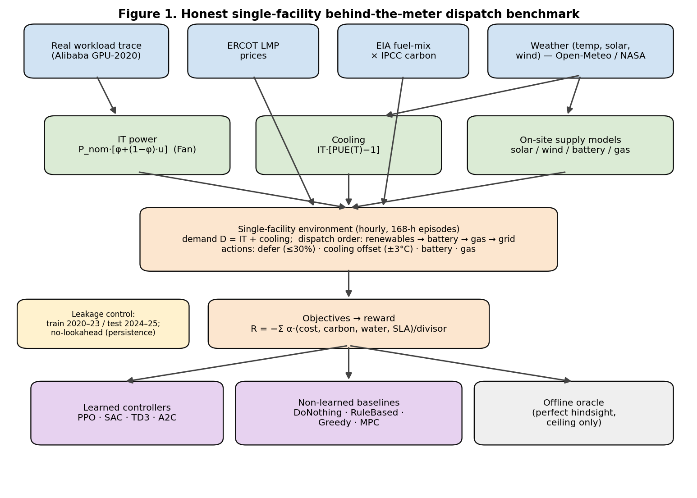
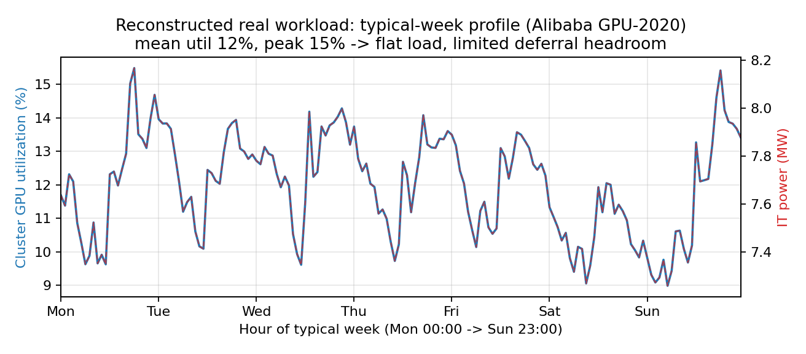
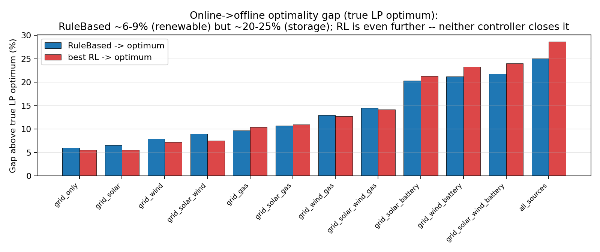
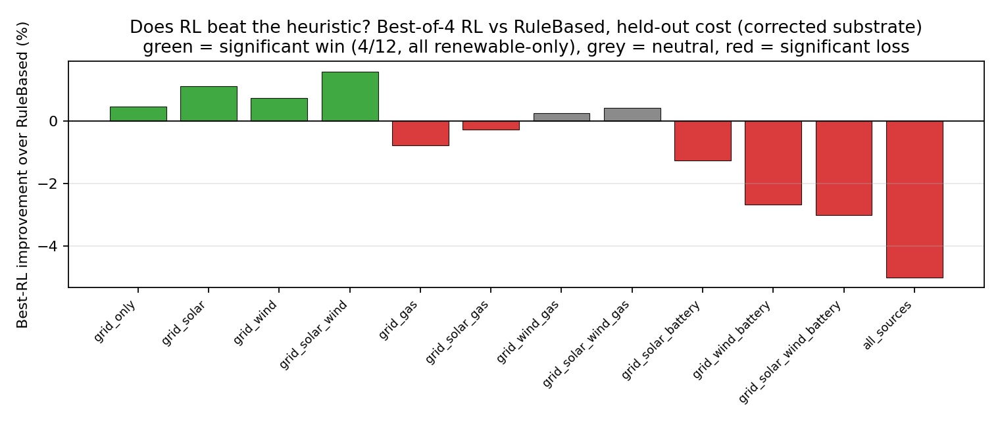
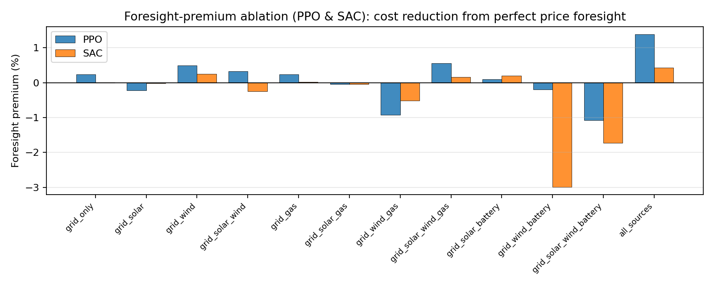
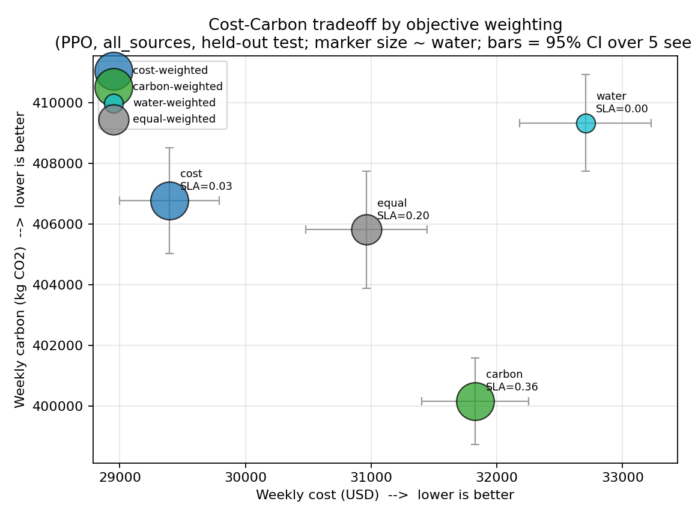
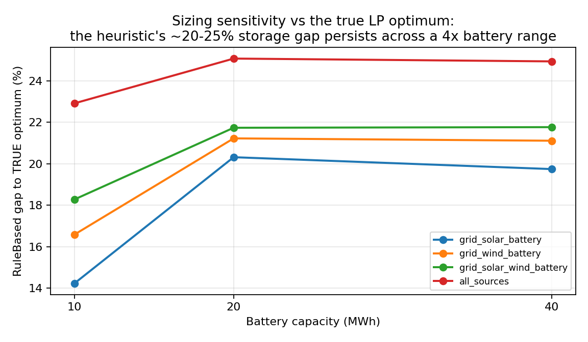

# Neither Near-Optimal Nor Learnable: An Honest, Leakage-Free Benchmark for Behind-the-Meter Data-Center Energy Dispatch

**Author:** Babasola Osibo
**Affiliation:** PENTREST GLOBAL LLC
**Contact:** basola.osibo@gmail.com

---

## ABSTRACT

Operators of single data centers increasingly place generation and storage — solar, wind,
batteries, and gas — behind their own meter, and a fast-growing literature applies deep
reinforcement learning (RL) to dispatch these assets against cost, carbon, water, and
service-level objectives. Much of that literature reports RL advantages under evaluation
protocols that leak information: episodes drawn from the same period used for training, or
perfect price foresight fed into the controller. We construct a leakage-free, real-data
benchmark for a single facility whose IT load is a replayed real workload trace (Alibaba
GPU-2020), whose cooling follows a physical temperature-dependent model, and whose market and
environmental signals are real ERCOT prices, EIA-derived grid carbon, and measured weather.
Four RL algorithms (PPO, SAC, TD3, A2C) are compared against four non-learned baselines
(DoNothing, a time-of-use RuleBased controller, Greedy, and a forecast-driven MPC) across
twelve on-site source configurations, under a strict 2020–2023 / 2024–2025 temporal split and a
no-lookahead forecast, and — critically — against a **true per-episode linear-programming
optimum** (economic dispatch with perfect foresight), which we use in place of the weak
quantile-threshold "oracle" common in this literature. Two findings result. First, on the
honest protocol the best RL controller significantly beats the heuristic in only **4 of 12**
configurations — all four renewable-only, by **0.5–1.6%** — and significantly *underperforms* it
in **every** storage configuration (best-algorithm losses to **−5.0%** at the full asset mix),
the opposite of where learning is assumed to help; handing the learner **perfect price foresight**
changes essentially nothing (mean premium ≈0 for both PPO and SAC), so the result is not an
artifact of the no-lookahead forecast. Second, and more consequentially, against the *true*
optimum **neither controller is near-optimal where it matters**: the heuristic sits ~6–9% above
the optimum in renewable-only dispatch but **~20–25% above it in storage-rich configurations**,
and RL is further still — a large online-to-offline gap that persists across a fourfold change
in battery sizing and that no controller here closes. (Perfect foresight buys that optimum
20–25% on storage yet buys RL ~0%, so the bottleneck is online storage coordination under
uncertainty, not forecast quality.) RL's one usable affordance is reward-weight steering: a
cost-heavy weighting is ~5% cheaper than a balanced one, while the carbon and water levers,
though now statistically resolved, are physically small (~1%). We conclude that the standard
framing is backwards: a well-tuned heuristic is a strong baseline that learning rarely beats
and often loses to, but *both* leave large value unclaimed against a genuine optimum in exactly
the storage-rich settings the field is rushing toward — a concrete open problem, not a solved one.

**Keywords:** data-center energy, reinforcement learning, model predictive control, behind-the-meter
dispatch, economic-dispatch optimum, online-to-offline gap, multi-objective optimization, honest
evaluation, temporal leakage.

---

## 1. INTRODUCTION

### 1.1 Motivation
Data-center electricity demand is rising steeply — the IEA estimates data centres consumed
roughly 1.5% of global electricity (~415 TWh) in 2024 and projects this to roughly double by
2030 — and a widening share of new capacity is being planned with on-site generation and
storage — a broader shift toward data-center green-energy integration surveyed by Osibo and
Adamo (2023) — to relieve interconnection queues and hedge volatile wholesale prices. For operators
of a *single* site — colocation, edge, and enterprise facilities that cannot route load to
another region — the lever that remains is *behind-the-meter dispatch*: deciding, hour by
hour, how to serve the facility's load from a mix of grid import, on-site solar and wind,
battery storage, and a gas generator, while respecting cost, carbon, water, and
service-level (SLA) objectives. Industry interest in treating data centers as grid-flexible
resources that "align compute with available power" has made this dispatch problem newly
prominent: EPRI's DCFlex initiative (2024) and a NVIDIA/Emerald AI demonstration of a ~25%
power reduction during a peak window (2025), and — most directly — a 2026 EPRI/NVIDIA/
Prologis/InfraPartners plan to site a fleet of 5–20 MW "micro" data centers at utility
substations, running inference and shifting compute to wherever grid headroom exists (Waltz
and Genkina 2026). That
substation program also frames why *on-site* flexibility matters even without spatial
routing: grid peaks last under 200 hours per year, and EPRI estimates compute would need to
move to a different substation only about 0.1% of the time — so most of the value is in
riding out the rare constrained windows locally, which is exactly what behind-the-meter
dispatch does.

A large body of recent work applies deep reinforcement learning to data-center energy
management and reports that learned controllers beat conventional control. We revisit that
claim for the single-facility case, and we do so under an evaluation designed to remove the
two shortcuts that most often inflate RL results in this field.

### 1.2 The honesty gap
Two evaluation flaws recur in the literature and in our own experiments:

1. **Temporal leakage.** When training and test episodes are both sampled from the entire
   historical record, an agent can be scored on the very weeks it trained on. Any controller
   that memorizes recurring price patterns then looks better than it would in deployment.
2. **Oracle foresight.** When the controller's observation includes the *true* future price,
   the learned policy is solving a much easier problem than a real one, and the reported
   advantage does not transfer to a setting where the future must be forecast.

We remove both. Training uses only episodes that begin and end before a fixed split date;
evaluation uses only the held-out later period. The controller receives no lookahead — its
forecast inputs are the current price (a persistence forecast) — and perfect foresight is
retained solely as a labeled upper bound. We then measure what advantage, if any, survives.

### 1.3 Contributions
1. A **leakage-free, real-trace, single-facility, multi-source benchmark** — environment,
   baselines, RL harness, and statistical protocol — that is reproducible and reusable.
2. An **honest head-to-head** comparison of four RL algorithms against four non-learned
   controllers across twelve source configurations, under a temporal split and a no-lookahead
   forecast: RL significantly beats the well-tuned heuristic in only 4/12 (renewable-only)
   configurations and significantly loses in every storage configuration.
3. A **true LP economic-dispatch optimum** used as the ceiling in place of the weak
   quantile-threshold "oracle" prevalent in this literature, revealing a large
   **online-to-offline gap** (~6–9% renewable, **~20–25% storage**) that neither the heuristic
   nor RL closes — with a side-by-side demonstration that the quantile oracle *understates* that
   gap by 3–5× and thereby manufactures a spurious "near-optimal heuristic" conclusion.
4. A **foresight-premium ablation** (PPO **and** SAC, with a paired significance test) showing
   perfect price foresight barely helps the learners (mean premium ≈0) even though it is worth
   20–25% to the true optimum on storage — isolating the bottleneck as online storage
   coordination under uncertainty, not forecast quality.
5. A **multi-objective weight sweep** (20 seeds, with a carbon-visible observation) showing the
   cost lever is strong (~5%) while the carbon/water levers are statistically real but
   physically small (~1%).

This work is the rigorous, real-data validation of the buildable core of the author's prior
vision paper (Osibo 2025), deliberately stripped of that paper's speculative
elements (quantum, blockchain energy trading, urban-mobility signals). It uses only real,
causal, reproducible inputs.

---

## 2. RELATED WORK

### 2.1 Landscape
Research on data-center energy optimization clusters into three groups that are adjacent to,
but distinct from, the problem studied here.

*Fleet and geo-distributed workload shifting.* Google's carbon-intelligent computing platform
(Radovanović et al. 2023) shifts flexible compute in time, and across regions in space, to track
low-carbon supply. Green-DCC (Sarkar et al. 2025) uses a hierarchical RL controller to
distribute workload across a **geographically dispersed cluster** of data centers while
co-optimizing liquid and air cooling and intra-site workload time-shifting. DCcluster-Opt
(Guillen-Perez et al. 2025) formalizes **geo-distributed** scheduling in which a
top-level agent reassigns or defers tasks across grid-supplied sites (across 20 regions, with
network latency and transmission costs) to trade off carbon, cost, SLA, and water. All of
these assume each site draws from the grid and optimize the *placement or timing* of load;
none co-dispatches on-site generation and storage behind a single meter.

*Single-site benchmarks.* The closest prior single-facility benchmark is SustainDC (Naug
et al. 2024), which couples workload scheduling, cooling, and battery management at
one site. Its battery is grid-charged storage/backup rather than one asset in an on-site
solar/wind/gas *generation* mix, and it does not adopt a leakage-free, oracle-free evaluation.
Notably, SustainDC, Green-DCC, and DCcluster-Opt all originate from the same research group,
which is the dominant benchmark line in sustainable-DC RL — and it targets clusters,
geo-distribution, and cooling, not single-facility behind-the-meter generation dispatch.

*Single-signal, single-site control.* A separate line of work optimizes one signal at one
site — carbon-aware scheduling, or time-of-use price response — typically for a single
objective. These do not address the coupled multi-source, multi-objective dispatch problem.

*Forecasting and control building blocks.* Temporal Fusion Transformers (Lim et al. 2021)
and model-predictive control (e.g., Lazic et al. 2018 for data-center cooling) are standard
components we reuse as baselines rather than as contributions.

*Single-site on-site-asset work adjacent to ours.* A recent cluster of papers studies on-site
generation and storage at a single data center but along different axes, and we distinguish each.
Rafique et al. (2026, *Energies*) design a hybrid MILP-plus-RL controller for multi-zonal data
centers with renewables and battery, reporting the hybrid beats an uncertainty-aware MILP by up
to ~33%; their question is *controller design* (RL vs MILP), whereas ours is a *benchmark*
evaluation (RL vs a well-tuned heuristic, both measured against a true LP optimum), and our
finding is the opposite in spirit — RL does not reliably beat the rule. Abdelhady et al. (2026,
*Applied Energy*) develop a regret-minimization framework for *strategic portfolio investment* in
on-site solar, wind, gas, and battery for hyperscale sites, showing diversified portfolios
dominate grid-only ones; that is an asset-sizing problem at a multi-year horizon, while we study
hour-by-hour operational dispatch of an already-sized asset mix. Figini & Paolone (2025,
arXiv:2412.13853) and Iqbal & Sarwat (2026, *IEEE Access*) each solve a *sizing* or
*reliability-under-outage* problem for a single storage/PV stack — the former carbon/cost-aware
PV+ESS sizing, the latter behind-the-meter BESS dispatch for critical-load continuity under
stochastic outages — neither compares RL to a heuristic nor uses an LP optimum as a ceiling; the
outage regime Iqbal & Sarwat target is precisely the non-stationary setting we defer to a
companion study (§6.6). Liu, Shin & Deka (2026, arXiv:2605.16190) co-optimize co-located BESS and
flexible compute for grid-services value via robust day-ahead optimization, again single-storage
and optimization-based rather than a multi-source RL-vs-heuristic benchmark. Together these works
investigate our seven axes *separately*; none integrates them into one leakage-free,
multi-source, RL-vs-heuristic-vs-true-optimum benchmark.

### 2.2 Novelty delta
Prior systems fall into three camps: (a) shifting workload in space and time across a **fleet
or geo-distributed cluster**, assuming each site is grid-supplied (Radovanović et al. 2023;
Green-DCC; DCcluster-Opt); (b) optimizing a **single** signal at one site (carbon-aware or
price-aware scheduling); or (c) single-site benchmarks that manage workload, cooling, and a
grid-charged **battery**, but not an on-site *generation* mix (SustainDC). None targets the
*single-facility, behind-the-meter* problem of co-dispatching grid import with on-site solar,
wind, battery, and gas against coupled cost/carbon/water/SLA objectives, and none does so
under a **leakage-free, oracle-free** evaluation. Our contribution is not a new algorithm; it is
the honest benchmark, a **true LP economic-dispatch optimum used as the ceiling**, and the
findings they produce — that learned control loses to a well-tuned heuristic wherever storage is
present, and that against a genuine optimum *both* leave a large (~20–25%) unclaimed gap on
storage that the quantile-threshold "oracle" common in this literature hides. The prevailing
benchmark line in this field (SustainDC, Green-DCC, DCcluster-Opt, all from one group) cannot
surface this because it never isolates the single-site, multi-source generation subproblem and
does not measure against a genuine optimization ceiling.

---

## 3. SYSTEM MODEL AND SUBSTRATE

We model the facility as an hourly discrete-time control problem over one-week (168-hour)
episodes. Every physical quantity below is implemented exactly as stated; all parameters are
disclosed and sensitivity-tested (§7). Units: prices
are converted to $/kWh (ERCOT LMP $/MWh ÷ 1000), grid carbon to kg/kWh (gCO₂/kWh ÷ 1000), and
gas to $/kWh from Henry Hub $/MMBtu via division by 0.11723 × 1000.

*Figure 1. The benchmark pipeline: real data inputs (workload trace, ERCOT prices, EIA-derived
carbon, weather) drive the substrate models (Fan IT-power, PUE(T) cooling, on-site supply) and
the single-facility environment (dispatch order renewables→battery→gas→grid); the weighted
objective is optimized by the learned and non-learned controllers and bounded by the offline
LP optimum, all under the leakage-control protocol (2020–23 train / 2024–25 test, no-lookahead
forecast).*

### 3.1 Facility and assets
A single data center with IT nameplate P_nom = 20 MW and idle fraction φ = 0.30. On-site
assets at design sizing: 5 MW solar, 5 MW wind, a 20 MWh battery rated at 10 MW (C/2) with a
**0.90 round-trip efficiency** (√0.90 ≈ 0.949 applied at each of charge and discharge; §3.4),
and a 2 MW gas generator with a CO₂ emission factor of 0.41 kgCO₂/kWh (EIA/EPA natural-gas
electricity, ~0.91 lb CO₂/kWh). We study the
**twelve** source configurations obtained by enabling subsets of
{solar, wind, battery, gas} on top of the always-present grid tie (grid_only, grid_solar,
grid_wind, grid_gas, grid_solar_wind, grid_solar_battery, grid_wind_battery, grid_solar_gas,
grid_wind_gas, grid_solar_wind_battery, grid_solar_wind_gas, all_sources). This factorial
design attributes any controller advantage to specific asset types rather than the aggregate.

### 3.2 Real workload trace → IT power
IT load is driven by a **replayed real workload trace**, not a synthetic profile. From the
Alibaba `cluster-trace-gpu-v2020` trace we reconstruct hourly cluster utilization by replaying
instance start/end events weighted by per-instance usage and normalizing by machine capacity
(the method established for this trace, Weng et al. 2022). Because the trace timestamps are
desensitized (time-of-day and day-of-week are real, calendar dates are not), we collapse the
reconstruction into a **typical-week profile** of 168 values indexed by (day-of-week × 24 +
hour-of-day) and replay it onto the 2020–2025 timestamp axis. Utilization u(t) ∈ [0,1] maps to
IT power through a linear idle/peak envelope (Fan et al. 2007):

  IT(t) = P_nom · [ φ + (1 − φ) · u(t) ],  with P_nom = 20 MW, φ = 0.30.

The reconstructed load is diurnally structured but relatively flat: the replayed typical-week
profile the agent actually sees has mean ≈ 12% and peak ≈ 15% of capacity (the raw pre-aggregation
hourly trace peaks at ≈ 25%, smoothed by the typical-week averaging) — a genuine property of ML
clusters, disclosed as a limit on deferral headroom (§7).

*Figure 2. Reconstructed typical-week workload (Alibaba GPU-2020): cluster GPU utilization and
the derived IT power. The load is diurnal but relatively flat, limiting deferral headroom.*

### 3.3 Physical cooling
Cooling power is derived from IT power and real ambient temperature T(t) via a
temperature-dependent PUE:

  cooling(t) = IT(t) · [ PUE(T(t)) − 1 ],
  PUE(T) = PUE_min + s · max(0, T − T_ref),  PUE_min = 1.25, s = 0.01 /°C, T_ref = 20 °C.

The uncontrolled facility demand is D(t) = IT(t) + cooling(t) (mean ≈ 9.7 MW at design sizing).

### 3.4 On-site generation and storage models
*Solar (5 MW):* from shortwave irradiance G(t) (W/m²),
P_solar(t) = clip( G(t) · 32,679 · 0.18 · 0.85 / 1000, 0, 5000 ) kW — i.e. a 32,679 m² array at
18% module efficiency and 0.85 performance ratio, sized to reach the 5 MW nameplate at
1000 W/m². The array is driven by the data center's own ambient
weather, giving a ~17% capacity factor — lower than a purpose-sited utility solar farm — so
solar-config savings here are conservative.
*Wind (5 MW):* a cubic power curve in wind speed v(t) (m/s) with cut-in 3.5, rated 12, cut-out
25: P_wind = 5000 · ((v − 3.5)/8.5)³ for 3.5 ≤ v < 12; 5000 for 12 ≤ v ≤ 25; 0 otherwise.
*Battery:* SoC-tracked with a **0.90 round-trip efficiency** (√0.90 ≈ 0.949 applied at each of
charge and discharge, so the product is 0.90) and a power cap of 10 MW; grid
charging incurs cost and carbon at the current LMP/intensity, while excess renewable
(generation above demand) charges the battery for free up to 95% SoC. This free renewable
charging is applied automatically **regardless of the agent's battery action** — surplus
on-site generation is never spilled while headroom exists — so the SoC transition is not fully
determined by the agent's explicit battery command; we disclose this as an implicit dynamic
the learner must infer (revisited in §7 and §6.2 as one reason storage coordination is hard). *Gas:* dispatchable up to 2 MW at Henry Hub cost
and 0.41 kgCO₂/kWh (§3.1).

### 3.5 Real market and environmental data
Dispatch runs on real ERCOT LMPs; grid carbon intensity is the EIA hourly fuel mix combined
with IPCC emission factors; weather (temperature, humidity, solar irradiance, wind speed) is
measured (Open-Meteo / NASA POWER). CAISO price history begins only in 2023 and is excluded
from the multi-year run to keep the market signal consistent across the full 2020–2025 span
(§7).

### 3.6 State, actions, and load dynamics
The **observation** is an 18-dimensional vector of normalized signals: cyclical hour and month
encodings; normalized IT load, cooling load, temperature, humidity, solar irradiance, and wind
speed; normalized grid price, grid carbon, and gas price; battery SoC; normalized available
solar and wind; and two price-forecast inputs at 4 h and 24 h (see §4.1). The **action** is
four continuous controls: workload deferral a₁ ∈ [0,1] (scaled to a hard cap of 30% of load),
cooling setpoint offset a₂ ∈ [−1,1] (mapped to ±3 °C, which scales mechanical cooling by
1 − 0.03·offset and evaporative water by 1 + 0.05·offset), battery signal a₃ ∈ [−1,1]
(negative = charge, positive = discharge), and gas dispatch fraction a₄ ∈ [0,1]. Deferred work
accumulates up to a ceiling of 30% × load × 12 h; when the ceiling is exceeded the excess is
force-served and an **SLA violation** is recorded, and one-twelfth of the deferred backlog is
served each hour. Served demand is met in the priority order **renewables → battery → gas →
grid**, so zero-marginal-cost on-site generation is always used first.

### 3.7 Objectives and reward
Per hour we accumulate three physical costs from the dispatch above: monetary cost (battery
grid-charging + gas + grid draw, each × its price), carbon (same energies × their carbon
factors), and water via an evaporative model
water(t) = cooling(t) · 1.8 · h_f · T_f · w_f / 1000 [m³], where h_f = 1 + (50 − RH)/100
(drier air evaporates more water per unit of cooling),
T_f = 1.2 if T > 25 °C, 0.5 if T < 10 °C, else 1.0, and w_f = 1 + 0.05·offset. The reward is
the negative weighted sum of the four **normalized** objectives:

  R(t) = − ( α_cost · cost/C + α_carbon · carbon/K + α_water · water/W + α_sla · SLA ),

where SLA is a **latching** penalty: once any violation has occurred in the episode, the full
α_sla term is charged every remaining hour (so a single early violation can incur up to ~167
penalty-hours), which makes the SLA term a strong deterrent against ever exceeding the
deferral ceiling. The divisors C, K, W are the
mean hourly cost, carbon, and water over the loaded substrate — computed **from the data**, not
hand-set: C = mean(D·price) = 592.1, K = mean(D·carbon) = 3683.7,
W = mean(water_ref) = 2.638. Data-derived divisors keep every objective at order ≈ 1 so none
silently dominates, and they recalibrate automatically if the substrate changes. Unless a
sweep overrides them (§5.7), the weights are α = (cost 0.4, carbon 0.3, water 0.2, SLA 0.1).

### 3.8 Parameter summary
Table V consolidates the substrate and control parameters for reproducibility; all are fixed
across configurations and seeds (asset capacities are zeroed when a source is disabled).

**TABLE V — Substrate and control parameters.**

| Group | Parameter | Value |
|---|---|---|
| IT power | nameplate P_nom; idle fraction φ | 20 MW; 0.30 |
| Cooling | PUE_min; slope s; T_ref | 1.25; 0.01 /°C; 20 °C |
| Solar | nameplate; area; module eff.; perf. ratio | 5 MW; 32,679 m²; 0.18; 0.85 |
| Wind | nameplate; cut-in / rated / cut-out | 5 MW; 3.5 / 12 / 25 m/s |
| Battery | capacity; power cap; round-trip η (√0.90 each end); free-charge SoC cap | 20 MWh; 10 MW; 0.90; 0.95 |
| Gas | capacity; emission factor | 2 MW; 0.41 kgCO₂/kWh (EIA/EPA) |
| Deferral / SLA | max per-hour deferral; accumulation ceiling | 30% of load; 30%·load·12 h |
| Cooling action | setpoint offset; mech. scale; water scale | ±3 °C; 1 − 0.03·offset; 1 + 0.05·offset |
| Water model | base coeff.; humidity factor; temp factor | 1.8; 1 + (50−RH)/100; 1.2 / 1.0 / 0.5 |
| Reward weights | α (cost / carbon / water / SLA) | 0.4 / 0.3 / 0.2 / 0.1 |
| Reward divisors | C / K / W (data-derived) | 592.1 / 3683.7 / 2.638 |
| Episode / split | length; train / test; test indices | 168 h; 2020–23 / 2024–25; [35064, 52272] |
| Evaluation | held-out episodes; matched seeds | 200; 8000–8199 |
| Training | steps/run; parallel envs; total campaign | 1×10⁶; 4; 445 runs (240 main + 120 foresight PPO+SAC + 80 Pareto @20 seeds + 5 sizing) |

---

## 4. EXPERIMENTAL DESIGN

### 4.1 Leakage controls
Two mechanisms enforce honesty and are the methodological core of the paper.

*Temporal split.* Training episodes are restricted to start indices whose entire one-week
horizon lies before the split date of 1 January 2024; evaluation episodes are drawn only from
the held-out 2024–2025 period (environment step indices [35064, 52272]). Nothing an agent sees
at test time was available during training.

*No lookahead.* The environment exposes a forecast mode. In the reported condition,
`persistence`, the controller's 4-hour and 24-hour price-forecast inputs are simply the
current price, so the agent receives no future information. A second mode, `oracle`, injects
the true future price and is used **only** for the labeled foresight ablation in §5.6; it is
never a headline result.

### 4.2 Baselines (exact definitions)
All baselines act on the same 18-dim observation and 4-dim action space as the RL agents, so
the comparison is like-for-like. We define them precisely for reproducibility.

- **DoNothing** — action (0, 0, 0, 0): no deferral, no cooling offset, no battery or gas
  dispatch. Renewables are still consumed automatically (they sit first in the dispatch
  order), so this is the "grid + free renewables" floor.
- **RuleBased** (time-of-use heuristic, the headline comparator) — fixed deferral a₁ = 0.6
  (≈18% of load); battery charge a₃ = −0.7 during 01:00–05:00 and discharge a₃ = +0.8 during
  16:00–21:00, else idle; gas a₄ = 0.8 during 16:00–20:00, else 0; no cooling offset.
- **Greedy** (myopic price response, no foresight) — defer a₁ = 0.8 when the normalized price
  exceeds 0.3 else 0.2; discharge (a₃ = +0.6) when price is high, charge (a₃ = −0.6) when low,
  else idle; dispatch gas when it is cheaper than the grid.
- **MPC** (forecast-driven control) — compares the current price to its 4 h and 24 h forecast
  inputs, discharging/deferring when now looks expensive relative to the future and
  charging/running when it looks cheap. Under the reported `persistence` forecast these inputs
  equal the current price, so its look-ahead signal is ≈0 and it degrades toward inaction — a
  *naive-forecast* MPC, stated explicitly and revisited in §5.5.
- **LP optimum** (offline economic-dispatch ceiling, perfect foresight) — for each episode we
  solve a linear program that minimizes total dispatch cost (grid draw + gas + grid-charging)
  subject to the exact physical constraints every controller faces: battery state-of-charge
  dynamics with the 0.90 round-trip efficiency and 10 MW power cap, 0 ≤ SoC ≤ capacity, gas
  capacity, hour-by-hour energy balance with renewables used first, and workload deferral
  modeled with the environment's own SLA-avoiding 1/12-per-hour backlog drain. Solved with
  perfect price/renewable/demand foresight (HiGHS), it is a genuine per-episode cost minimum —
  a true lower bound on achievable cost, verified to satisfy LP ≤ RuleBased on every episode.
  It replaces the quantile-threshold rule (charge in the cheapest price quartile, discharge in
  the most expensive) that much of this literature labels the "oracle"; that
  rule ignores SoC and coupling and is itself far from optimal, so it *understates* the true
  optimality gap (§5.2). The LP is deliberately conservative in one respect — it does not
  exploit the cooling-offset cost lever — so its reported gap is a lower bound on the true one.
  It is a ceiling for measurement, never a deployable controller.

### 4.3 Learned controllers
We train **PPO** (Schulman et al. 2017), **SAC** (Haarnoja et al. 2018), **TD3** (Fujimoto
et al. 2018), and **A2C** (Mnih et al. 2016), all via Stable-Baselines3 (Raffin et al. 2021),
with a shared MLP policy and identical
hyperparameters across all configurations, so differences reflect the configuration and the
algorithm, not per-case tuning. Salient settings: learning rate 3×10⁻⁴ (7×10⁻⁴ for A2C),
γ = 0.99, GAE λ = 0.95; PPO with n_steps 2048, batch 64, 10 epochs, clip 0.2; SAC/TD3 with
replay buffer 10⁵ and batch 256 (SAC with automatic entropy tuning); A2C at the
Stable-Baselines3 default n_steps = 5. Each run trains for
1×10⁶ steps with four parallel environments. One caveat follows from using stock
per-algorithm defaults: A2C's 5-step rollout is short for the 168-hour storage
credit-assignment problem (a charge decision often pays off many hours later), so A2C's
comparatively large storage losses (§5.4) partly reflect this hyperparameter mismatch rather
than a pure algorithmic property. We report A2C as-is for completeness but base the headline
verdict on the best-of-four algorithm per configuration.

### 4.4 Protocol and statistics
We train **240 policies** (4 algorithms × 12 configurations × 5 seeds) with hardened
checkpointing: a held-out evaluation is logged at every 100k-step checkpoint, and for the
off-policy methods the replay buffer is persisted so a resumed run does not silently train on a
degraded buffer. Every controller — RL and baseline alike — is evaluated on **200 held-out
episodes with matched seeds 8000–8199**, so all methods are scored on identical weeks. We
compare per-episode cost with paired tests and **Holm-correct across the full family of 48
tests (4 algorithms × 12 configurations)**, and report Wilcoxon signed-rank tests, bootstrap
95% confidence intervals, and Cohen's d alongside. A result is "significant" only when the
Holm-adjusted p < 0.05 **and** the direction favors the named controller. Two properties of the
comparison should be read alongside these statistics. First, the RL cost fed into each paired
test is the **per-episode mean across the five seeds** (a five-policy ensemble), whereas each
baseline is a single deterministic run; averaging shrinks the RL per-episode variance by
roughly √5, which raises the paired test's power asymmetrically and matters most at the
smallest (0.5–1.1%) renewable-only margins. Second, because every controller is scored on the
*same* price/weather weeks, per-episode costs are highly correlated and the paired-difference
standard deviation is small, so Cohen's d is inflated relative to the economic effect (e.g.
d ≈ 0.84 accompanies a 0.51% cost change); we therefore treat the **bootstrap 95% CI on the
mean cost difference** as the primary effect-size and read d only as a secondary signal. To
avoid a garden-of-forking-paths, the substrate and
hyperparameters were fixed before the held-out evaluation and not tuned against it; the real
workload and sizing sweeps are pre-registered robustness checks reported either way.

---

## 5. RESULTS

### 5.1 A note on the comparison baseline
The headline comparator is the RuleBased heuristic. Table I shows why: across the full
matched-protocol baseline set, RuleBased is the lowest-cost non-oracle controller in every
configuration except the four gas configurations, where Greedy edges it by less than 0.1%. It is,
in other words, the strongest cheap controller, and the fair opponent for a learned policy.

**TABLE I — Matched-protocol weekly cost (USD), held-out test, n = 200, persistence forecast.
Lowest-cost controller in bold; "MPC−RB" is MPC's penalty relative to RuleBased. The "MPC" column is
a *naive-forecast* MPC: under the persistence forecast its look-ahead signal is ≈0, so it
degrades toward inaction (§5.5) — it is not a competent forecast-driven controller.**

| Configuration | DoNothing | RuleBased | Greedy | MPC | MPC−RB |
|---|---:|---:|---:|---:|---:|
| grid_only | 50,747 | **50,095** | 50,263 | 50,312 | +0.4% |
| grid_solar | 46,114 | **45,462** | 45,630 | 45,679 | +0.5% |
| grid_wind | 38,545 | **37,893** | 38,061 | 38,110 | +0.6% |
| grid_solar_wind | 33,912 | **33,263** | 33,429 | 33,478 | +0.6% |
| grid_gas | 50,747 | 48,550 | **48,531** | 50,018 | +3.0% |
| grid_solar_gas | 46,114 | 43,916 | **43,898** | 45,385 | +3.3% |
| grid_wind_gas | 38,545 | 36,348 | **36,329** | 37,816 | +4.0% |
| grid_solar_wind_gas | 33,912 | 31,719 | **31,711** | 33,184 | +4.6% |
| grid_solar_battery | 46,114 | **42,919** | 44,967 | 45,679 | +6.4% |
| grid_wind_battery | 38,545 | **35,041** | 37,396 | 38,110 | +8.8% |
| grid_solar_wind_battery | 33,912 | **29,834** | 32,729 | 33,478 | +12.2% |
| all_sources | 33,912 | **28,998** | 31,103 | 33,184 | +14.4% |

### 5.2 How far is the heuristic from the *true* optimum? Not near, where it counts.
A central methodological choice is the ceiling. Much of this
literature calls a quantile-threshold rule (charge in the cheapest price quartile,
discharge in the most expensive) the "oracle." That rule ignores state-of-charge limits and
inter-hour coupling, so it is itself far from optimal, and comparing against it manufactures a
flattering conclusion. Measured against it, RuleBased looks "near-optimal": the RB→quantile-oracle
gap is only 4–7% for storage configs and even *touches zero* at a 40 MWh battery (Table IV,
right block). Measured against the **true LP optimum**, the picture inverts.

Table Ib reports, per configuration, how far RuleBased and the best RL controller sit above the
genuine per-episode LP optimum (§4.2). The heuristic is near-optimal *only* in renewable-only
dispatch (6.0–9.0%); in every storage-rich configuration it leaves **20–25%** on the table, and
RL is further still. The quantile oracle understated this gap by 3–5×.

**TABLE Ib — Distance above the TRUE LP optimum (held-out test, n = 200). Gap = (cost − LP)/cost.
"Quantile-oracle gap" is the old, weak ceiling shown for contrast. LP ≤ RuleBased every config.**

| Configuration | RuleBased $ | Best RL $ | LP optimum $ | RB→opt | RL→opt | (old quantile-oracle RB gap) |
|---|---:|---:|---:|---:|---:|---:|
| grid_only | 50,095 | 49,869 | 47,091 | 6.0% | 5.6% | 3.0% |
| grid_solar | 45,462 | 44,958 | 42,457 | 6.6% | 5.6% | 3.3% |
| grid_wind | 37,893 | 37,617 | 34,889 | 7.9% | 7.3% | 3.9% |
| grid_solar_wind | 33,263 | 32,736 | 30,265 | 9.0% | 7.5% | 4.5% |
| grid_gas | 48,550 | 48,926 | 43,844 | 9.7% | 10.4% | 4.9% |
| grid_solar_gas | 43,916 | 44,041 | 39,210 | 10.7% | 11.0% | — |
| grid_wind_gas | 36,348 | 36,258 | 31,642 | 12.9% | 12.7% | 6.6% |
| grid_solar_wind_gas | 31,719 | 31,586 | 27,112 | 14.5% | 14.2% | — |
| grid_solar_battery | 42,919 | 43,461 | 34,199 | **20.3%** | 21.3% | 4.8% |
| grid_wind_battery | 35,041 | 35,979 | 27,603 | **21.2%** | 23.3% | 4.4% |
| grid_solar_wind_battery | 29,834 | 30,734 | 23,349 | **21.7%** | 24.0% | 4.7% |
| all_sources | 28,998 | 30,450 | 21,725 | **25.1%** | 28.7% | 6.9% |

So the well-worn "heuristic is near-optimal" claim is an artifact of a weak oracle. Against a
real optimum, both a well-tuned heuristic and RL leave **~a fifth to a quarter of the storage
bill unclaimed** — a large online-to-offline gap that neither controller here closes, and that
RL actually *widens*. Renewable-only dispatch is the only regime where the heuristic genuinely
comes close (6–9%). This gap — not a 1% RL-vs-heuristic delta — is the central finding.

*Figure 3. Distance above the true LP optimum, per configuration. RuleBased (blue) is within
~6–9% in renewable-only dispatch but ~20–25% above optimum in storage-rich configs; the best RL
controller (red) is further still. Neither closes the online-to-offline gap.*

### 5.3 Main benchmark: does RL beat the heuristic?
Table II reports, for each configuration, the best of the four RL algorithms, its improvement
over RuleBased, and whether that difference is significant after Holm correction (across the
48-test family).

**TABLE II — Best RL vs RuleBased on held-out cost (matched seeds, n = 200). Positive Δ% =
cheaper than RuleBased. "sig. loss" = the RL deficit is Holm-significant.**

| Configuration | RuleBased | Best RL (algo) | Δ% vs RB | Significant? |
|---|---:|---|---:|:---:|
| grid_only | 50,095 | 49,869 (SAC) | +0.45 | win |
| grid_solar | 45,462 | 44,958 (SAC) | +1.11 | win |
| grid_wind | 37,893 | 37,617 (SAC) | +0.73 | win |
| grid_solar_wind | 33,263 | 32,736 (TD3) | +1.58 | win |
| grid_gas | 48,550 | 48,926 (PPO) | −0.78 | sig. loss |
| grid_solar_gas | 43,916 | 44,041 (PPO) | −0.28 | sig. loss |
| grid_wind_gas | 36,348 | 36,258 (SAC) | +0.25 | no |
| grid_solar_wind_gas | 31,719 | 31,586 (TD3) | +0.42 | no |
| grid_solar_battery | 42,919 | 43,461 (PPO) | −1.26 | sig. loss |
| grid_wind_battery | 35,041 | 35,979 (PPO) | −2.68 | sig. loss |
| grid_solar_wind_battery | 29,834 | 30,734 (PPO) | −3.02 | sig. loss |
| all_sources | 28,998 | 30,450 (PPO) | −5.01 | sig. loss |

The best RL controller significantly beats RuleBased in **four of twelve** configurations, and
all four are renewable-only (`grid_only`, `grid_solar`, `grid_wind`, `grid_solar_wind`), with
margins of 0.5–1.6%. In the two gas-only-adjacent wins (`grid_wind_gas`, `grid_solar_wind_gas`)
the best margin is +0.2–0.4% and does not clear Holm correction. Everywhere a battery is present
— and in the two simplest gas configs — RL is a **significant loss**. No single algorithm
dominates the wins (SAC and TD3 split them), which argues against a robust learned advantage;
PPO is uniformly the "best" (least-bad) algorithm in the storage configs, and even it loses.

### 5.4 The storage-degradation pattern
The most consistent effect in the study is a failure, not a win. In **every configuration that
contains a battery**, the best RL controller is *worse* than the fixed RuleBased
charge/discharge schedule, and the loss deepens as the asset mix grows: −1.3%
(`grid_solar_battery`), −2.7% (`grid_wind_battery`), −3.0% (`grid_solar_wind_battery`), and
**−5.0%** (`all_sources`) for the best algorithm in each case; the weaker learners degrade
further, and per-algorithm Holm tests confirm the losses are significant. This is the opposite
of the common assumption that storage — with its inter-temporal coupling — is where learning
adds the most value.

Two readings are tempting; the true-optimum ceiling (§5.2) forces the correct one. It is *not*
that "the fixed schedule is already near-optimal, and RL merely mis-times against it": against
the LP optimum the schedule itself leaves 20–25% unclaimed on these very configs (Table Ib). The
accurate statement is that **storage makes the problem hard for everyone, and hardest for the
learner** — a charge decision pays off many hours later, so storage turns each hour into a
week-long credit-assignment problem that RL's value estimates handle worst, leaving it *below*
even an imperfect fixed rule. The degradation is not a sizing artifact: it persists across a
fourfold battery range (§5.8).

*Figure 4. Best-of-four RL improvement over RuleBased on held-out cost, per configuration
(green = significant win, grey = neutral, red = significant loss). The four
significant wins are all renewable-only (0.5–1.6%); every battery configuration is a significant
loss, deepening with asset-mix complexity to −5.0% at the full mix.*

### 5.5 The naive MPC, and where the real headroom is
Table I shows our MPC underperforming RuleBased everywhere, by +0.4% in the simplest cases and
up to +14.4% with the full asset mix. This is a direct consequence of the honest protocol: with
a persistence forecast, MPC's price-versus-future signal is near zero, so its lookahead logic
rarely fires and it degrades toward a do-little controller. It is a *naive-forecast* MPC, not a
competent one — we include it only to show that bolting a controller onto a zero-information
forecast buys nothing.

The interesting question is what a *good* forecast-driven optimizer could do, and here the LP
optimum is informative in a way the old quantile "oracle" was not. The LP is precisely a
perfect-foresight receding-horizon optimizer solved to global optimality, and it captures the
20–25% storage headroom that RuleBased and RL both miss (§5.2). In other words, the large
online-to-offline gap is largely the *value of forecast-driven optimization that we did not
attempt to realize online*. This reframes forecast-MPC (e.g. with a Temporal-Fusion-Transformer
price model, Lim et al. 2021) as the single most promising direction for closing the gap. How much of
the perfect-foresight 20–25% survives realistic forecast error is exactly the open question this
benchmark is built to pose; we leave the forecast-MPC arm to future work and flag it as the
natural next controller, not a settled non-issue.

### 5.6 Foresight-premium ablation
The common rebuttal to a weak RL showing is "it would win with a better forecaster." We test
this directly by training **both PPO and SAC** (the two algorithms that produce the wins and
the least-bad storage losses) across all twelve configurations with **perfect price foresight**
in the observation (`forecast_mode = oracle`), and comparing per-configuration held-out cost to
the honest persistence agents on identical seeds and window, with a per-episode paired test. The
**foresight premium** (persistence minus oracle cost) is essentially zero for both: it averages
**+0.08% for PPO and −0.37% for SAC** (Table IIb; Figure 5). Where the premium is statistically
resolvable it is economically negligible (sub-1% either way), and SAC is if anything slightly
*worse* with foresight — consistent with overfitting a high-information input that does not
change the dispatch the agent can actually execute.

The force of this result comes from the contrast with §5.2: **perfect foresight is worth 20–25%
to the LP optimum on storage configs, but ~0% to the learned controllers.** Foresight is not the
missing ingredient for RL; the bottleneck is the agent's inability to convert future information
into correctly-timed multi-hour storage decisions. The honest no-lookahead verdict therefore does
not understate RL — its ceiling here is genuinely low, independent of forecast quality — even
though the *problem* has large foresight value that a different (optimization-based) controller
can capture.

**TABLE IIb — Foresight premium (persistence minus oracle cost)/persistence, per configuration,
for PPO and SAC. Positive = foresight makes the learner cheaper. Per-episode paired test.**

| Configuration | PPO premium | SAC premium |
|---|---:|---:|
| grid_only | +0.24% | +0.00% |
| grid_solar | −0.22% | −0.01% |
| grid_wind | +0.49% | +0.25% |
| grid_solar_wind | +0.33% | −0.24% |
| grid_gas | +0.24% | +0.02% |
| grid_solar_gas | −0.04% | −0.05% |
| grid_wind_gas | −0.92% | −0.52% |
| grid_solar_wind_gas | +0.55% | +0.16% |
| grid_solar_battery | +0.10% | +0.20% |
| grid_wind_battery | −0.19% | −3.00% |
| grid_solar_wind_battery | −1.07% | −1.73% |
| all_sources | +1.39% | +0.43% |

*Mean premium: PPO +0.08% (range −1.07..+1.39), SAC −0.37% (range −3.00..+0.43).*

*Figure 5. Foresight premium per configuration for PPO and SAC — the held-out cost reduction from
perfect price foresight. It hovers around zero for both learners, even though the same perfect
foresight is worth 20–25% to the LP optimum (§5.2): foresight is not the missing ingredient for
learned control in this regime.*

### 5.7 Multi-objective weight sweep
Although RL does not beat the heuristic on the scalar objective, we ask a distinct question:
when RL *is* used, do its reward weights give an operator predictable control over the
cost/carbon/water tradeoff? We train PPO on `all_sources` under four weightings — cost-heavy,
carbon-heavy, water-heavy, and balanced — with **20 seeds each** (enough that the
smaller levers are adequately powered), on the same held-out window, with grid carbon as a
*visible* observation. This is analyzed separately from the
benchmark above, because the weighted reward is not comparable across weightings.

**TABLE III — Held-out weekly objectives by weighting (mean ± 95% CI over 20 seeds); weights
are cost/carbon/water/SLA.**

| Weighting | Cost (USD) | Carbon (kg CO₂) | Water (m³) | SLA (viol.) |
|---|---:|---:|---:|---:|
| cost-heavy (0.7/0.1/0.1/0.1) | **29,396 ± 397** | 406,775 | 446.6 | 0.03 |
| carbon-heavy (0.1/0.7/0.1/0.1) | 31,829 | **400,157 ± 1,425** | 446.5 | 0.36 |
| water-heavy (0.1/0.1/0.7/0.1) | 32,705 | 409,336 | **437.4 ± 2.9** | 0.00 |
| balanced (0.3/0.3/0.3/0.1) | 30,962 | 405,814 | 442.1 | 0.20 |

The weighting knob behaves as designed: each single-objective-heavy weighting minimizes its own
objective (bold diagonal), all four points are mutually Pareto-non-dominated, and — with 20
seeds and grid carbon among the observations — all three levers are **statistically significant**.
The *magnitudes*, however, separate a strong lever from weak ones. Relative to the balanced
point, the cost-heavy weighting cuts cost by **5.1%** (Welch p < 0.001), whereas the carbon-heavy
weighting cuts carbon by only **1.4%** (p < 0.001) and the water-heavy weighting cuts water by
**1.1%** (p = 0.019). That the carbon/water effects are real but only ~1% shows the weak
carbon/water authority is **physical, not an artifact**: renewables are already dispatched first, the battery is
grid-charged, and gas is carbon-dirty, so there is little room to trade carbon or water without
simply spending more. The two aggressive weightings incur a small SLA cost (≈0.2–0.4
violations/week) versus near-zero for the water-heavy point. The practical message: RL offers
usable steering on **cost** (~5%) and only marginal, though genuine, control over carbon and
water (~1%) in this regime.

*Figure 6. Cost–carbon tradeoff across the four objective weightings (marker size ∝ water;
bars = 95% CI over 20 seeds). The weightings form a non-dominated front, but the carbon axis is
compressed — the carbon lever is real yet small (~1%) even though grid carbon is a visible
observation.*

### 5.8 Sizing sensitivity
Is the large storage gap an artifact of the 20 MWh battery? We re-evaluate RuleBased against the
true LP optimum at 10, 20, and 40 MWh (rate scaled C/2). Table IV shows the gap is large at every
size — 14–25% — growing from 10→20 MWh and then plateauing; it is not a sizing artifact and it
does not shrink with more storage.

**TABLE IV — RuleBased→true-optimum gap (%) by battery capacity, matched protocol. For contrast,
the old *quantile-oracle* gap (right block) shrinks to ~0 at 40 MWh — the weak oracle's artifact,
not reality.**

| Configuration | 10 MWh | 20 MWh | 40 MWh | | quantile-oracle 10/20/40 |
|---|---:|---:|---:|---|---|
| grid_solar_battery | 14.2 | 20.3 | 19.7 | | 3.9 / 4.8 / −0.0 |
| grid_wind_battery | 16.6 | 21.2 | 21.1 | | 4.7 / 4.4 / 0.1 |
| grid_solar_wind_battery | 18.3 | 21.7 | 21.8 | | 5.6 / 4.7 / 0.9 |
| all_sources | 22.9 | 25.1 | 24.9 | | 7.9 / 6.9 / 3.7 |

Against the true optimum the heuristic leaves ~20–25% unclaimed across a fourfold sizing range,
so its storage sub-optimality is structural, not a design-point artifact. The contrast column is
itself a finding: the quantile "oracle" gap *shrinks toward zero* at 40 MWh — because that
threshold rule is also poor at exploiting a large store, so it converges to RuleBased — which is
exactly how a weak ceiling manufactures a false "the heuristic becomes near-optimal with more
storage" conclusion. The true optimum shows the opposite: more storage means more unexploited
value, for both the heuristic and (per §5.4) the learner. Training PPO on `all_sources` at
40 MWh confirms the learner side directly: RL loses to RuleBased by **−6.4%** at 40 MWh
(RL $28,071 vs RB $26,376), a wider deficit than the −5.0% at 20 MWh, and it sits ~30% above the
true optimum — the RL storage shortfall widens with capacity rather than washing out.

*Figure 7. Battery-sizing sensitivity of the RuleBased→true-optimum gap. The ~20–25% storage gap
persists across a 4× sizing range (growing 10→20 MWh, then flat) — structural, not a sizing
artifact.*

---

## 6. DISCUSSION

### 6.1 Near-optimal for renewables, far from optimal for storage
The heuristic's distance from the true optimum splits cleanly by regime, and the split is
instructive. In **renewable-only** dispatch the fixed schedule is genuinely near-optimal (~6–9%
from the LP): the exploitable structure is highly regular (ERCOT prices and solar/wind
availability are strongly diurnal), the deferral headroom is small (the replayed
typical-week workload is flat, mean ≈ 12%, peak ≈ 15%, so the 30%/12 h lever moves few kWh), and with no
storage there is no inter-temporal arbitrage to get wrong — a time-of-use rule captures almost
everything there is. Add a **battery** and the same rule falls **20–25% short** of the optimum.
Storage converts a near-static problem into a genuine sequential-optimization problem: the value
of charge now depends on the entire future price/renewable path, and the optimum exploits every
hour of that path, whereas the fixed schedule commits to two windows a day and the learner
mistimes. The lesson is not "heuristics are near-optimal" (the conclusion a weak quantile oracle
invites) but "the optimality gap is small only where the problem is near-static; storage opens a
large gap that no controller we tested closes."

### 6.2 Why storage is where RL fails, not where it wins
The intuitive expectation is that storage — with its inter-temporal coupling — is exactly
where a learner should beat a myopic rule. We observe the opposite, and the true optimum sharpens
why. It is *not* that the fixed schedule leaves little headroom — against the LP it leaves 20–25%
(§5.2). Rather, storage turns each per-hour decision into a **credit-assignment problem across
the week** — a charge now pays off many hours later — which is precisely where RL's value
estimates are noisiest; the off-policy learners (TD3, A2C) degrade most, consistent with value
over-/under-estimation on long-horizon storage returns. So there is *lots* of headroom, and the
learner captures even less of it than a two-window-a-day rule: RL ends up **below** the heuristic
(−1.3% → −5.0% as solar+wind+battery+gas stack) while **both sit far below the optimum**. The
deficit is not a sizing artifact — the RuleBased→optimum gap holds at 20–25% across a fourfold
battery range (§5.8), and RL's shortfall relative to the heuristic persists with it. In short:
storage is hard for everyone here and hardest for the learner, and the field's assumption that it
is where RL shines is exactly inverted.

### 6.3 The economics: RL is the wrong lever, and the right lever is large
Two numbers should guide investment here. The first is the RL-vs-heuristic delta: at best ~1–1.6%
of the weekly bill in renewable-only dispatch (~$20k/yr for a ~10 MW site), negative everywhere a
battery is present. Against ~$80–120M of build capital and the cost of training, validating,
serving, and assuring a safety-critical learned controller, a sub-2% renewable-only trim that
turns into a 1–5% *loss* on storage does not justify RL for this problem. The second number is the
one that matters: the **20–25% storage gap to the true optimum** that *neither* controller
captures. That is the real, unclaimed prize, and it is an order of magnitude larger than anything
the RL-vs-heuristic contest is fighting over. The engineering takeaway is therefore twofold: do
not deploy RL for single-facility behind-the-meter dispatch (a well-tuned heuristic is cheaper,
simpler, and better on storage), and do not conclude the problem is solved — a forecast-driven
optimizer (§5.5) is the lever aimed at the part of the bill that is actually on the table.

### 6.4 Where RL adds (narrow) value: cost steering
Where learning earns some keep is not *beating* the heuristic on a scalar objective but
**steering** through the reward weights (§5.7). A single trained policy family, re-weighted,
gives an operator predictable and statistically significant control over **cost** — a
cost-heavy weighting is ~5% cheaper than a balanced one (Welch p < 0.001) — tracing a
non-dominated front that a fixed rule does not offer. The value is narrower than one might hope:
with 20 seeds the carbon and water levers are now statistically resolved but **physically small**
— carbon −1.4% (p < 0.001) and water −1.1% (p = 0.019) versus balanced. Crucially, this weakness
is physical, not informational: even though grid carbon is a visible observation, the carbon
lever is only ~1%, because renewables are dispatched first, the battery is grid-charged, and gas
is carbon-dirty. RL
here is therefore a *cost-focused policy-family generator*, not a general multi-objective knob;
operators should not expect more than marginal carbon or water control from this action space.
The small magnitude of the carbon and water levers is a caution in itself: multi-objective
authority in this setting is sensitive to substrate fidelity and to whether the relevant signal
is actually observable to the agent.

### 6.5 Implications for how the field evaluates
Our results also carry a methodological message, and we are careful to separate the two
common shortcuts. **Temporal leakage** — sampling train and test episodes from the same record
— demonstrably inflates the apparent advantage: in our experiments, a leaky split reported a
larger RL edge that the temporal split removed. The second shortcut, **oracle price foresight** in the
observation, we tested head-on (§5.6) and found it does *not* help the learned controller here
(mean premium ≈0); so in our case its removal is not what drives the verdict, but it remains
bad practice because it flatters forecast-driven controllers and is undeployable. The honest
picture is thus doubly robust: the advantage is small under a leakage-free split, and it does
not grow even with perfect foresight. Because these shortcuts are widespread, some reported
single-site RL gains are plausibly evaluation artifacts rather than control skill. We therefore
argue that leakage-free splits, oracle-free observations, and a *well-tuned heuristic reported
as the comparator* (not a strawman) should be the default hygiene for this literature.

### 6.6 Scope and where learning should help
These conclusions are bounded by the reliable-grid, cost-smooth regime studied here (§7). The
natural place to expect a genuine RL advantage is where the environment is **non-stationary and
event-driven** rather than smoothly diurnal — most sharply, on **unreliable grids** where
unscheduled outages make outage-aware on-site dispatch and diesel avoidance a high-variance,
high-stakes control problem in which a fixed schedule cannot anticipate the disruption. That
regime, using real outage data, is the subject of a companion study; the honest, reusable
benchmark established here is its foundation. A recent critical review of energy-storage
solutions for AI data centers (Mohammadi et al. 2026, arXiv:2603.00415) independently identifies
gaps in simulation tools, degradation and forecasting models, and multi-layer sizing as open
challenges — the same integration gap this benchmark is built to probe.

---

## 7. THREATS TO VALIDITY

1. **Sub-hour burst smoothing.** The trace provides per-instance lifetime-average usage, so
   the reconstructed load smooths sub-hourly bursts; standard for this trace and disclosed.
2. **GPU-dominated, heterogeneous facility.** The trace is a GPU cluster; utilization→power is
   GPU-TDP-based. We frame the facility as an AI data center accordingly.
3. **Replayed, not calendar-real, load.** Trace timestamps are desensitized; the load is real
   in structure but not a real calendar sequence, and the temporal split is applied to the
   grid signals where leakage actually lives.
4. **Modeled power and cooling.** The load is real, but IT power and cooling are models, not
   metered facility telemetry. The comparative conclusions are therefore more robust than any
   single absolute figure.
5. **Single facility, modeled sizing.** Mitigated by the sizing sensitivity of §5.8, which
   shows the central result is stable across a 4× battery range.
6. **ERCOT-only multi-year run.** CAISO history begins in 2023; cross-market generalization is
   future work.
7. **Simulation, not deployment.** Standard in this field (Green-DCC, Sustain-Cluster are also
   simulation studies).
8. **Modeled substrate parameters.** The substrate depends on several modeled
   constants (Table VI). The key robustness argument is structural: because *every* controller —
   RL, heuristics, and the oracle — is evaluated on the *same* substrate, changing these
   parameters shifts the *absolute* cost/carbon/water levels but largely preserves the *relative*
   comparisons the paper reports. In particular, the **sign of the RL-vs-heuristic difference**
   (RL loses on storage) and the **ordering of the online-to-offline gap** (small for renewables,
   large for storage) are properties of the dispatch structure, not of the exact parameter
   values, because every controller — RL, heuristics, and the LP optimum — is scored on the same
   substrate and seeds. Parameters that enter only one objective (e.g. the water coefficient)
   move that objective's absolute level without touching the cost verdict. We regard the exact
   magnitude of the storage gap (20–25%) as parameter-dependent at the ±few-point level, but its
   existence and the qualitative renewable-vs-storage split as robust.

   **TABLE VI — Modeled parameters and sensitivity scope.**

   | Parameter | Baseline | Plausible range | Primarily affects | Expected effect on the verdict |
   |---|---|---|---|---|
   | Idle fraction φ | 0.30 | 0.20–0.40 | facility load / absolute cost | shifts levels; relative verdict robust |
   | PUE_min | 1.25 | 1.10–1.40 | cooling share / cost | shifts levels; relative verdict robust |
   | PUE slope s | 0.01 /°C | 0.005–0.02 | cooling vs temperature | minor; relative verdict robust |
   | Solar eff.×PR | 0.18 × 0.85 | ±20% | renewable availability | may slightly change renewable-config margins |
   | Wind cut-in / rated | 3.5 / 12 m/s | ±1 / ±2 m/s | wind availability | may slightly change wind-config margins |
   | Gas emission factor | 0.41 kgCO₂/kWh | 0.35–0.55 | carbon in gas configs | affects carbon objective, not cost verdict |
   | Water coefficient | 1.8 | ±25% | water objective only | isolated to water; no cost effect |
   | IT-power envelope | linear (Fan) | SPEC-power convex alt. | IT power shape | shifts levels; relative verdict robust |
8a. **The LP optimum is a conservative ceiling.** The LP does not exploit the cooling-offset cost
   lever and models deferral with the environment's own 1/12-per-hour backlog drain rather than
   free load-shifting; both make it *under*-optimize slightly, so the reported optimality gaps
   (20–25% on storage) are **lower bounds** on the true gap. It is verified to satisfy
   LP ≤ RuleBased on every episode.
9. **MPC ran on a persistence forecast.** Disclosed; ours is a naive-forecast MPC included only
   to show a zero-information forecast buys nothing. Per §5.5 the LP optimum (a perfect-foresight
   optimizer) captures the 20–25% storage headroom, so a competent forecast-driven MPC is the
   natural next controller and a promising route to close the gap — future work.
10. **Reward-normalization divisors use full-record statistics.** The data-derived divisors
   C, K, W (§3.7) are the mean hourly cost/carbon/water over the entire 2020–2025 record,
   including the 2024–2025 test window. This is a mild normalization dependency, not an outcome
   leak: the divisors are fixed scalars that only *shape the training reward*; every **reported**
   cost/carbon/water figure is an absolute physical quantity computed independently of them, and
   all controllers are scored identically. Recomputing the divisors on the training window only
   would not affect the reported numbers.
For scale, the train-only cost divisor would be ≈733 versus the 592 used (a 19% difference,
because the 2024–25 test window is a cheaper price regime than the 2020–23 training window) — a
reward-shaping offset identical across all controllers, not an evaluation leak.
11. **Implicit environment dynamics around storage.** Two dispatch behaviors are deterministic
   properties of the substrate rather than agent choices, and we disclose them because they
   shape the storage results: (a) surplus on-site renewable auto-charges the battery up to 95%
   SoC *regardless of the agent's battery action* (§3.4), so SoC is not fully controllable from
   the explicit action; and (b) the SLA penalty *latches* — once any violation occurs it is
   charged every remaining hour of the episode (§3.7). Both are identical across all controllers,
   so they do not bias the relative comparison, but they help explain why storage coordination
   is hard for the learner (§6.2).
12. **Foresight-ablation seed parity.** The foresight premium (§5.6) pairs the oracle-mode and
   persistence-mode PPO runs by construction — both were launched from the same
   `EVAL_SEED_BASE = 8000` held-out seed set (8000–8199) in the same harness — but this parity
   is assumed from the launch configuration rather than re-verified episode-by-episode from a
   stored seed vector in each artifact. A per-episode seed-hash check is left as a hardening item.

---

## 8. CONCLUSION

On an honest, leakage-free, real-trace benchmark for single-facility behind-the-meter dispatch,
deep reinforcement learning beats a well-tuned time-of-use heuristic in only **4 of 12**
configurations — all renewable-only, by 0.5–1.6% — and significantly *underperforms* it in every
storage configuration, to −5.0% at the full asset mix; handing the learner perfect price
foresight changes essentially nothing for either PPO or SAC. So the field's premise is at best
half-right: sophistication is not free, and a well-tuned heuristic is a strong baseline that
learning here rarely beats and often loses to.

But the more consequential finding comes from measuring against a *true* per-episode LP optimum
rather than the quantile-threshold "oracle" this literature usually reports. That correction
alone flips the standard conclusion: the heuristic is near-optimal (~6–9%) only in renewable-only
dispatch, while in storage-rich configurations **both the heuristic and RL sit ~20–25% above the
true optimum** — a large online-to-offline gap that persists across a fourfold battery range and
that no controller we tested closes. Perfect foresight is worth that 20–25% to the optimum yet
~0% to the learners, which locates the bottleneck precisely: online storage coordination under
uncertainty, not forecast quality or the choice between heuristic and RL. RL's one usable
affordance is cost-weighted steering (~5%); its carbon and water levers, though now statistically
resolved, are physically small (~1%).

The practical verdict is therefore that RL is the wrong lever for this problem, but the problem is
far from solved: the prize is the storage gap, and a forecast-driven optimizer is the controller
aimed at it. Methodologically, we argue that leakage-free splits, oracle-free observations, a
well-tuned heuristic reported as the comparator, **and a genuine optimization-based ceiling**
should be the default hygiene for this literature — because a weak "oracle" manufactures a
comfortable "heuristics are near-optimal" story that a real optimum does not support. The honest,
reusable benchmark established here is the foundation for the harder, non-stationary regime —
unreliable grids with real outages — where a fixed schedule cannot anticipate the disruption and
learned control may finally earn its keep (a companion study).

---

## 9. REPRODUCIBILITY

**Artifacts.** All code and result artifacts are released in a public repository
(https://github.com/dev1-osibo/neither-near-optimal-nor-learnable): the simulation environment, the baseline
controllers, the true-optimum LP solver, the training harness, the evaluation and analysis
scripts, the automated integrity tests, the fixed seeds, and the exact temporal split, together
with a data-provenance description and the full set of result files. Every table and figure in
this paper regenerates from the released artifacts with a single command, and the complete
parameter set is consolidated in Table V.

**Automated integrity checks.** The two claims the paper leans on hardest are backed by unit
tests rather than assertion. (i) *No forecast leakage:* `tests/test_env_forecast_leakage.py`
corrupts every price after time *t* by a large spike and verifies the two forecast observation
dimensions at *t* are unchanged in the reported `persistence` mode; a companion test confirms
`oracle` mode *does* react to future prices (so the test can actually detect leakage), and a
third asserts the default constructor is the honest `persistence` mode. (ii) *Correct workload
reconstruction:* `tests/test_workload_trace.py` checks the hourly utilization equals active
usage divided by machine capacity on a known toy cluster, that utilization is bounded to
[0, 1] even under excessive usage, and that the fitted typical-week model preserves diurnal
structure (peak-hour mean > trough-hour mean) when replayed.

**Determinism / provenance note.** The full campaign comprises 445 runs (240 main + 120 foresight
[PPO+SAC] + 80 Pareto [20 seeds] + 5 sizing), with zero failures, executed across two
matched-environment machines; a byte-identical data-and-code check confirmed both used one
canonical substrate, and fixed seeds make every run reproducible.

**Licensing.** The workload trace is used under the Alibaba Cluster Trace Program research
license (Weng et al. 2022); market (ERCOT), carbon (EIA + IPCC), and weather
(Open-Meteo / NASA POWER) sources are cited in §3.4.

---

## REFERENCES

*Formatted in ASA (American Sociological Association) style; in-text citations are author–date,
e.g., (Weng et al. 2022). Web-verified bibliography with locators is maintained in
`paper/REFERENCES.md`.*

Abdelhady, Mohamed Hamdi Ibrahim, Eleftherios T. Iakovou, and Efstratios N. Pistikopoulos. 2026.
"Optimal Energy Portfolio Investment Strategies for Data Centers under Deep Market Uncertainty."
*Applied Energy*.

Electric Power Research Institute. 2024. "DCFlex: Data Center Flexible Load Initiative." Palo
Alto, CA: EPRI. Retrieved (https://www.epri.com).

Fan, Xiaobo, Wolf-Dietrich Weber, and Luiz André Barroso. 2007. "Power Provisioning for a
Warehouse-Sized Computer." Pp. 13–23 in *Proceedings of the 34th Annual International Symposium
on Computer Architecture*. New York: ACM.

Figini, Enea, and Mario Paolone. 2025. "Achieving Dispatchability in Data Centers: Carbon and
Cost-Aware Sizing of Energy Storage and Local Photovoltaic Generation." *Sustainable Energy,
Grids and Networks* 43:101920. doi:10.1016/j.segan.2025.101920. arXiv:2412.13853.

Fujimoto, Scott, Herke van Hoof, and David Meger. 2018. "Addressing Function Approximation
Error in Actor-Critic Methods." Presented at the 35th International Conference on Machine
Learning (ICML), Stockholm, Sweden. arXiv:1802.09477.

Guillen-Perez, Antonio, Avisek Naug, Vineet Gundecha, Sahand Ghorbanpour, Ricardo Luna
Gutierrez, Ashwin Ramesh Babu, Munther Salim, Shubhanker Banerjee, Eoin H. Oude Essink, Damien
Fay, and Soumyendu Sarkar. 2025. "DCcluster-Opt: Benchmarking Dynamic Multi-Objective
Optimization for Geo-Distributed Data Center Workloads." Presented at the Conference on Neural
Information Processing Systems (NeurIPS), Datasets and Benchmarks Track. arXiv:2511.00117.

Haarnoja, Tuomas, Aurick Zhou, Pieter Abbeel, and Sergey Levine. 2018. "Soft Actor-Critic:
Off-Policy Maximum Entropy Deep Reinforcement Learning with a Stochastic Actor." Presented at
the 35th International Conference on Machine Learning (ICML), Stockholm, Sweden.
arXiv:1801.01290.

International Energy Agency. 2025. *Energy and AI*. Paris: International Energy Agency. Retrieved
(https://www.iea.org/reports/energy-and-ai).

Iqbal, Hasan, and Arif I. Sarwat. 2026. "Reliability-Constrained Behind-the-Meter BESS Dispatch
for Data Centers: Co-Optimizing Utility Costs and Critical-Load Continuity Under Stochastic
Outages." *IEEE Access* 14:79227–79252.

Lazic, Nevena, Craig Boutilier, Tyler Lu, Eehern Wong, Binz Roy, Moonkyung Ryu, and Greg
Imwalle. 2018. "Data Center Cooling Using Model-Predictive Control." In *Advances in Neural
Information Processing Systems 31 (NeurIPS)*.

Lim, Bryan, Sercan Ö. Arık, Nicolas Loeff, and Tomas Pfister. 2021. "Temporal Fusion
Transformers for Interpretable Multi-Horizon Time Series Forecasting." *International Journal of
Forecasting* 37(4):1748–1764.

Liu, Shaohui, Sungho Shin, and Deepjyoti Deka. 2026. "Watts vs. Bytes: Turning Data Centers into
Grid Assets via Storage–Compute Co-Optimization." arXiv:2605.16190.

Mnih, Volodymyr, Adrià P. Badia, Mehdi Mirza, Alex Graves, Timothy P. Lillicrap, Tim Harley,
David Silver, and Koray Kavukcuoglu. 2016. "Asynchronous Methods for Deep Reinforcement
Learning." Pp. 1928–1937 in *Proceedings of the 33rd International Conference on Machine
Learning (ICML)*. arXiv:1602.01783.

Mohammadi, Sina, Wayne Wang, Marcus Chen-I Wada, Rouzbeh Haghighi, Ali Hassan, Hualong Liu,
Archit Bhatnagar, Ang Chen, and Wencong Su. 2026. "Grid Integration of AI Data Centers: A
Critical Review of Energy Storage Solutions." arXiv:2603.00415.

Naug, Avisek, Antonio Guillen, Ricardo Luna Gutierrez, Vineet Gundecha, Sahand Ghorbanpour,
Sajad Mousavi, Ashwin Ramesh Babu, and Soumyendu Sarkar. 2024. "SustainDC: Benchmarking for
Sustainable Data Center Control." Presented at the Conference on Neural Information Processing
Systems (NeurIPS), Datasets and Benchmarks Track. arXiv:2408.07841.

Osibo, Babasola. 2025. "Transforming High-Energy Data Center Sites: Sustainability with
Predictive Analytics and Futuristic Technologies." *International Journal of Science and
Research* 14(8):903–911. doi:10.21275/SR25816234249.

Osibo, Babasola, and Simisola Adamo. 2023. "Data Centers and Green Energy: Paving the Way for a
Sustainable Digital Future." *International Journal of Latest Technology in Engineering,
Management & Applied Science* 12(11):15–30. doi:10.51583/IJLTEMAS.2023.121103.

Radovanović, Ana, Ross Koningstein, Ian Schneider, Bokan Chen, Alexandre Duarte, Binz Roy,
Diyue Xiao, Maya Haridasan, Patrick Hung, Nick Care, Saurav Talukdar, Eric Mullen, Kendal
Smith, MariEllen Cottman, and Walfredo Cirne. 2023. "Carbon-Aware Computing for Datacenters."
*IEEE Transactions on Power Systems* 38(2), March. arXiv:2106.11750.

Raffin, Antonin, Ashley Hill, Adam Gleave, Anssi Kanervisto, Maximilian Ernestus, and Noah
Dormann. 2021. "Stable-Baselines3: Reliable Reinforcement Learning Implementations." *Journal
of Machine Learning Research* 22(268):1–8.

Rafique, Abubakar, Xiaojun Yu, Muhammad Jawad, Qun Song, Zhaohui Yuan, Muhammad Tariq Sadiq,
Kamran Daniel, and Noman Shabbir. 2026. "Two-Stage Optimization-Learning Framework for
Uncertainty-Aware Multi-Zonal Data Center Energy Management." *Energies* 19(7):1736.
doi:10.3390/en19071736.

Sarkar, Soumyendu, Avisek Naug, Antonio Guillen, Vineet Gundecha, Ricardo Luna Gutierrez,
Sahand Ghorbanpour, Sajad Mousavi, Ashwin Ramesh Babu, Desik Rengarajan, and Cullen Bash. 2025.
"Hierarchical Multi-Agent Framework for Carbon-Efficient Liquid-Cooled Data Center Clusters
(Green-DCC)." arXiv:2502.08337.

Schulman, John, Filip Wolski, Prafulla Dhariwal, Alec Radford, and Oleg Klimov. 2017. "Proximal
Policy Optimization Algorithms." arXiv:1707.06347.

U.S. Energy Information Administration. 2024. "Hourly Electric Grid Monitor" (fuel mix by
balancing authority). Washington, DC: EIA. Retrieved (https://www.eia.gov).

Waltz, Emily, and Dina Genkina. 2026. "Small Data Centers Snuggle Up to Grid Substations."
*IEEE Spectrum*, July. Retrieved (https://spectrum.ieee.org/distributed-inference-data-centers).

Weng, Qizhen, Wencong Xiao, Yinghao Yu, Wei Wang, Cheng Wang, Jian He, Yong Li, Liping Zhang,
Wei Lin, and Yu Ding. 2022. "MLaaS in the Wild: Workload Analysis and Scheduling in Large-Scale
Heterogeneous GPU Clusters." In *Proceedings of the 19th USENIX Symposium on Networked Systems
Design and Implementation (NSDI)*. Berkeley, CA: USENIX Association.

*Additional data sources (Data Availability, §3.4/§9): ERCOT market LMPs; IPCC emission factors;
ASHRAE TC 9.9 thermal guidelines; Open-Meteo and NASA POWER weather. A few conference page
ranges (Weng et al.; Lazic et al.) are omitted where USENIX/NeurIPS proceedings do not
paginate; arXiv identifiers and DOIs are provided as stable locators.*
